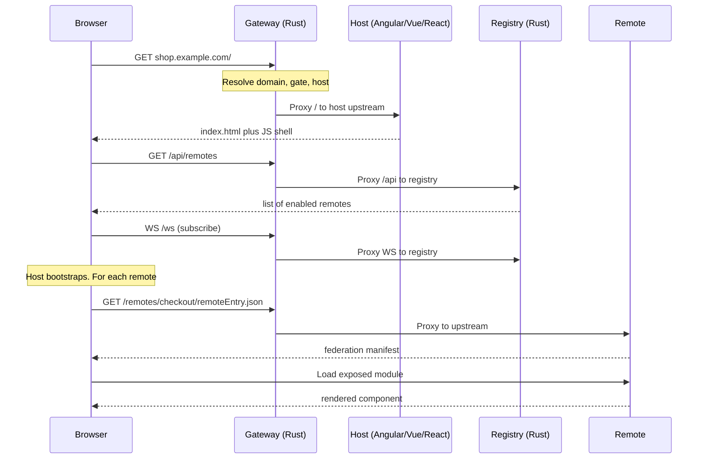
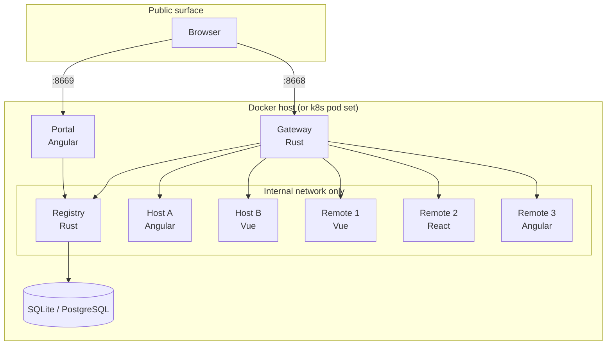

# Architecture

This page is the wire-level picture of what Nexus does at runtime. If you only want the conceptual model, read [Overview](overview.md) first.

## Request flow



The browser sees one origin per gate. Every internal service is hidden behind the gateway.

## The route table

The gateway's route table is built from registry entities, not from a static config file. The key insight: routes are domain-scoped.

```
Request: GET shop.example.com/remotes/checkout/remoteEntry.json
         │
         ▼
Gateway route table:
  by domain "shop.example.com"
    -> gate "storefront-prod"
       -> host "storefront" (Angular)
          -> public path "/"           upstream: http://host-angular:80/
          -> public path "/remotes/checkout/*"  upstream: http://remote-checkout:80/
          -> public path "/remotes/orders/*"    upstream: http://remote-orders:80/
          -> public path "/api/*"      upstream: http://registry:8670/api/
          -> public path "/ws"         upstream: ws://registry:8670/ws
```

When the registry broadcasts a change — `host_changed`, `gate_changed`, `remotes_changed` — the gateway recomputes the affected slice of the table and swaps it in atomically. Existing in-flight connections keep going; new connections see the new routes.

## Two timelines: cold start vs. live update

### Cold start (first visit)

```
T+0  ms  browser   GET /                          gateway
T+10 ms  gateway   resolve gate -> host           in-memory
T+15 ms  browser   GET /assets/index.html         host upstream
T+50 ms  browser   GET /remoteEntry.json          host upstream
T+100ms  browser   GET /api/remotes               registry
T+105ms  browser   WS /ws (subscribe)             registry
T+150ms  browser   loadRemote(checkout)
T+170ms  browser   GET /remotes/checkout/...      remote-checkout upstream
```

### Live add (operator adds a remote in the portal)

```
T+0  s   operator  POST /api/remotes              portal -> registry
T+5  ms  registry  INSERT into store
T+5  ms  registry  broadcast remotes_changed
T+8  ms  gateway   receive broadcast, hot-swap route table
T+10 ms  host      receive broadcast, register route (no reload)
T+20 ms  user      navigates to /new-remote, sees it work
```

No reload, no container restart, no downtime.

## Deployment topology



The gateway and the portal are the only services with public ports. The registry, hosts, and remotes communicate over Docker's internal network.

## Why a gateway in front of hosts

1. **Stable public URL contract.** `/host/*`, `/remotes/*`, `/api/*`, `/ws` are stable. Internal service names can change at will.
2. **One TLS termination point.** TLS happens at the gateway. Internal traffic is plain HTTP/2.
3. **One CORS origin.** Browser code always talks to its own origin. CORS is a non-issue except for the registry (which trusts the gateway and the portal).
4. **WebSocket proxying.** The gateway upgrades `/ws` to the registry. Browser code never sees the registry's URL.
5. **Single point of protection.** Seven DDoS layers run in the gateway. Upstream services trust their network.
6. **Per-gate routing.** A request for `admin.example.com` and a request for `shop.example.com` follow different paths in the same gateway process.

## Why a registry

Without one, every host build would hard-code the remote list — adding a remote means rebuilding the host. The registry inverts the dependency:

- Host asks: "what remotes can I load right now?"
- Registry answers from its database.
- A change via portal or API fans out over WebSocket to every connected host and the gateway.

The registry is the only stateful component. Its database is the source of truth.

## Three HTTP layers

There are three distinct HTTP layers in the request graph:

1. **Gateway (Rust).** Opaque reverse proxy. Routes by domain and URL prefix. Routes are derived from the registry and hot-swapped.
2. **Host (Angular / Vue / React).** Federation loader. Reads `/api/remotes`, loads each entry, registers routes in its own router.
3. **Registry (Rust).** REST + WebSocket. Owns the data. Broadcasts changes.

An operator can change which remotes are live (registry mutation → broadcast → gateway hot-swap + host route-add) without ever touching the gateway config or restarting any service.

## Token and correlation

| Header | Set by | Read by |
|---|---|---|
| `X-Nexus-Token` | every client (CLI, host, portal, remote on startup) | registry token middleware |
| `X-Request-ID` | every client (UUID v4 or ULID) | registry correlation middleware, log buffer |

Every registry log line and error response carries the correlation id, so a failed call in browser DevTools can be traced through the gateway, into the registry log, and out the WebSocket broadcast.

## Failure modes

| Failure | Effect on user | Recovery |
|---|---|---|
| One remote container dies | That remote's route returns 502 on next navigation. Other remotes unaffected. | Restart the container. Host receives no broadcast but next load works. |
| Host container dies | Browser cannot bootstrap the host shell — gateway returns 502 from `/`. | Restart the host. Browser app retries with configured backoff. |
| Registry container dies | Existing browser tabs keep working (cached remotes). New tabs see backup or empty list. | Restart the registry. Gateway and clients reconnect with exponential backoff. |
| Gateway container dies | Total outage for that gateway instance — no public surface. | Restart gateway. Run multiple instances behind a load balancer for HA. |
| Disk full on registry volume | Writes fail with 5xx. Reads still work. | Increase the volume, drain registry. |
| Gateway hot-swap fails | Routes stay as they were before the change. Registry logs the error. | The gateway retries on the next broadcast. |

The host has a three-layer fallback chain for registry reads:

```
1. live registry over HTTP
   └─ fail ─► 2. browser sessionStorage cache (last successful fetch)
              └─ fail ─► 3. static backup at /assets/registry-backup.json
```

Read [infra-high-availability](../infrastructure/infra-high-availability.md) for the multi-instance HA story.

## Reading the code

- Gateway entry: `nexus-gateway/src/main.rs`.
- Gateway route table: `nexus-gateway/src/route_table.rs`.
- Gateway protection: `nexus-gateway/src/protection.rs`.
- Registry entry: `nexus-registry/src/main.rs`.
- Registry HTTP API: `nexus-registry/src/api/{remotes,hosts,gates,system}.rs`.
- Registry WebSocket: `nexus-registry/src/ws/{hub,messages}.rs`.
- Registry config / hot reload: `nexus-registry/src/config/`.
- Angular runtime: `nexus-packages/packages/runtime/src/`.
- Vue runtime: `nexus-packages/packages/runtime-vue/src/`.
- React runtime: `nexus-packages/packages/runtime-react/src/`.
- Framework-agnostic loader: `nexus-packages/packages/runtime-core/src/`.

## Next

- [Ports and URLs](ports-and-urls.md) — the public URL contract.
- [Infra: registry](../infrastructure/infra-registry.md) — every endpoint, every message.
- [Infra: gateway](../infrastructure/infra-gateway.md) — the seven protection layers in detail.
