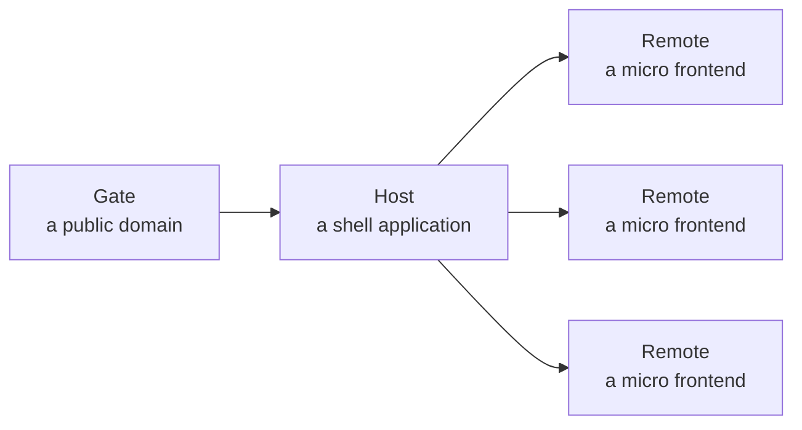
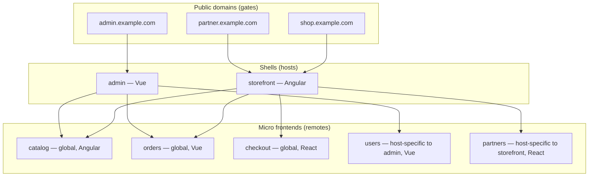

# Overview

Nexus organizes a frontend estate into three entities. Internalize them and the rest of the platform falls into place.

## The three entities



### Host

A **host** is a shell application written in Angular, Vue, or React. It owns the chrome — header, navigation, layout — and bootstraps the federation runtime. A host has a single `remoteEntry` and an `exposedModule`. It is referenced by one or more gates.

### Gate

A **gate** is a public entry point bound to a domain. `shop.example.com` is a gate. `admin.example.com` is another gate. A gate points to exactly one host, but many gates can point to the same host. That is how multi-domain or multi-brand sites share one application — different domain, same shell, possibly different remote selection.

### Remote

A **remote** is a micro frontend module. It registers itself with the registry at container startup. It exposes one or more modules (`./RemoteEntry` by convention). It has a **visibility** setting:

- `global` — every host can load this remote.
- `host:<host_id>` — only the named host can load it.

Visibility is enforced when the host fetches its remote list. A global remote shows up for everyone; a host-specific remote shows up only for its owner.

## How one registry covers an entire estate



Three gates. Two hosts in different frameworks. Five remotes, one of them React inside an Angular host, three of them shared. The operator can move a gate from one host to another in the portal — the change broadcasts in a few milliseconds and the user's next request hits the new host.

## Runtime trust zones

```
PUBLIC                          INTERNAL                       DEV-ONLY
=================               ====================           =================
:8668  gateway   ────────►   registry, host, remotes        (your laptop)
:8669  portal   ─────────►   registry HTTP + WS              :9000 dev proxy
                                                             :87xx local remote
```

- Public ports are the **only** ones bound on the Docker host. The gateway terminates everything else.
- All upstream services (`registry`, `host`, `remote-*`) live on the Docker network and are never exposed.
- The token (`X-Nexus-Token`) protects every write/read endpoint on the registry; `/health` is public.

## How the gateway discovers what to route

When the gateway starts it connects to the registry over WebSocket and fetches the initial state (`/api/hosts`, `/api/gates`, `/api/remotes`). It builds an in-memory route table keyed by domain → host → remote prefix → upstream URL. From that point it stays subscribed: whenever the registry broadcasts `host_changed`, `gate_changed`, or `remotes_changed`, the gateway swaps its routing table in place — atomically, no nginx reload, no dropped connection.

Read the details in [infra-gateway](../infrastructure/infra-gateway.md).

## Repository layout

Nexus is intentionally multi-repo so each piece has an independent lifecycle.

| Repo | Owner | Released as | Public? |
|---|---|---|---|
| `nexus` | platform | Docker compose orchestrator + this docs site | private |
| `nexus-gateway` | platform | `ghcr.io/bimo-dk/nexus-gateway` Docker image | yes |
| `nexus-registry` | platform | `ghcr.io/bimo-dk/nexus-registry` Docker image | yes |
| `nexus-portal` | platform | `ghcr.io/bimo-dk/nexus-portal` Docker image | yes |
| `nexus-host-template` | platform | Angular host scaffold | yes |
| `nexus-host-template-vue` | platform | Vue host scaffold | yes |
| `nexus-remote-templat` | platform | Angular remote scaffold | yes |
| `nexus-remote-templat-vue` | platform | Vue remote scaffold | yes |
| `nexus-remote-templat-react` | platform | React remote scaffold | yes |
| `nexus-proxy` | platform | dev-time hot-reload proxy | yes |
| `nexus-base-image` | platform | `ghcr.io/bimo-dk/nexus-base` Docker base | yes |
| `nexus-packages` | platform | npm `@bimo-dk/nexus-*` (10 packages) | yes |
| `nexus-example` | platform | runnable demo orchestrator | yes |

A product team creates **one repo per remote**, scaffolded from the framework template that matches their stack.

## What you do not have to do

- Hand-edit federation manifests — decorators and the Vite plugin generate them.
- Stand up a WebSocket transport — the registry ships one.
- Reinvent the host layout — use `provideNexusHost()` (Angular), `createNexusPlugin()` (Vue), or `NexusProvider` (React).
- Wire up auth headers, correlation IDs, or fallback chains — included.
- Restart anything to deploy a remote update — registry broadcast, gateway hot-swap, host route-add.
- Edit nginx config to add a remote — gateway discovers it from the registry.
- Maintain an env-var listing your remotes — the remote announces itself.

## Next

- [Installation](installation.md) — five-minute setup.
- [Architecture](architecture.md) — request flow, deploy flow, failure modes.
- [Ports and URLs](ports-and-urls.md) — the public URL contract.
