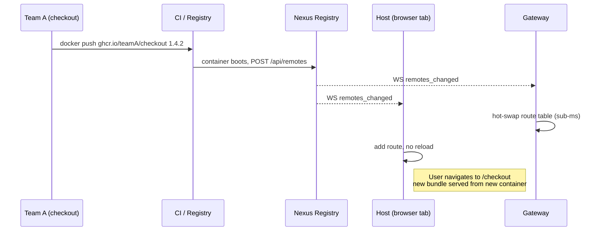

# Why Nexus

Module Federation, Native Federation, single-spa, Bit, Nx — they each solve *one* aspect of running micro frontends in production. None of them solve the operational layer: the registry, the routing, the protection, the framework boundary, the dev loop. Nexus is the layer that turns federation primitives into a platform you can hand to a multi-team product organization without each team rebuilding the same plumbing.

## What you do not have to build

| You don't write | Because Nexus provides |
|---|---|
| A federation manifest per remote | `@NexusRemote()` (Angular) or `nexusVite({ name, exposes })` (Vue / React) — config is generated at build time |
| A WebSocket client with reconnect logic | `@bimo-dk/nexus-client` ships `RegistryWebSocket` with exponential backoff |
| A token-aware HTTP layer | `provideNexusHost()`, `createNexusPlugin()`, `NexusProvider` inject the auth header for you |
| A registry sync loop in the host | `provideNexusHost()` / Vue plugin / React provider does it in one line |
| A fallback chain when the registry is down | Three layers: live → sessionStorage cache → static backup, baked into the runtime |
| A framework-agnostic loader | `@bimo-dk/nexus-runtime-core` does the federation glue once, each framework adapter wraps it |
| nginx config for every new remote | Gateway reads the route table from the registry and hot-swaps on every change |
| DDoS protection middleware | Seven layers shipped in the Rust gateway, configurable from the portal |
| A health-check loop | Built into the registry, exposed at `/health` and on the portal |
| A Prometheus exporter | Native `/metrics` on both registry and gateway |
| A multi-domain routing layer | Gates: one application, many public domains |
| An admin UI | The portal — manages hosts, gates, remotes, protection, configuration |
| A dev mode for one team at a time | `bnx dev` runs your remote locally against shared staging |
| A scaffold for each framework | `bnx generate remote` with framework selection |

That is what Nexus *removes*. What it *adds* is one mental model — gates, hosts, remotes — that maps to how product organizations actually think about a frontend estate.

## What it costs you

Honest tradeoffs:

- **You buy into the three frameworks Nexus supports today.** Angular 19, Vue 3, React 18. If your stack is Svelte or Solid, you'd need to write an adapter against `@bimo-dk/nexus-runtime-core` first. (The runtime-core surface is small — under 500 lines.)
- **The registry is the source of truth.** Lose the registry's database and you lose your host/gate/remote configuration. Back it up. The registry runs on SQLite (default), Postgres, MySQL or MariaDB — see [infra-high-availability](../infrastructure/infra-high-availability.md) for the HA story.
- **The token model is currently symmetric.** Anyone with `NEXUS_TOKEN` can mutate the registry. A per-identity model is on the roadmap; for now, treat the token like a database password and rotate it via the portal.

## When Nexus is not the right answer

- **You ship a single-team, single-framework SPA.** You don't have a federation problem. Skip the platform.
- **You ship purely server-rendered pages.** Nexus loads ES modules in the browser. SSR is supported in the host framework, but the federation boundary is client-side.
- **You need detection-evading client-side code splitting.** Nexus is transparent — every remote shows up in DevTools.

## A multi-team workflow, end to end



No host restart. No registry restart. No gateway restart. No user reload.

Team B sees Team A's component in the portal catalog the moment Team A's container starts. Team B drops it into their own remote with one line:

```html
<nexus-component remote="checkout" expose="CartSummary" [inputs]="{ compact: true }" />
```

## Adoption shape

A typical adoption is incremental:

1. **Week 1.** Stand up the orchestrator. `docker compose up` from the `nexus` repo. Existing apps untouched.
2. **Week 2.** First remote. One team scaffolds with `bnx generate remote`, deploys, registers. The portal shows it.
3. **Month 2.** Convert the layout shell. Your existing monolith's outer chrome becomes the host. Inner pages move to remotes one at a time.
4. **Month 3+.** Catalog adoption. Teams add `@NexusComponent()` or the catalog field on `nexusVite` to components they think others might want. The catalog populates organically; cross-team reuse becomes possible.

You do not go all-in on day one. The registry happily serves a single remote.

## Next

- [Overview](overview.md) — the three-entity mental model in detail.
- [Installation](installation.md) — `docker compose up` in five minutes.
- [Architecture](architecture.md) — every box, every arrow.
