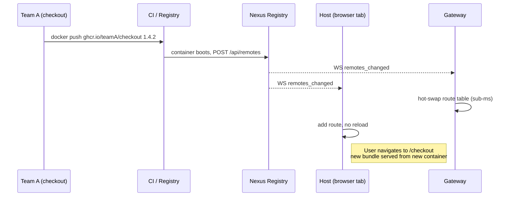

# Why Nexus

Module Federation, Native Federation, single-spa, Bit, Nx — they each solve *one* aspect of running micro frontends in production. None of them solve the operational layer: the registry, the routing, the protection, the framework boundary, the dev loop. Nexus is the layer that turns federation primitives into a platform you can hand to a multi-team product organization without each team rebuilding the same plumbing.

## What you do not have to build

| You don't write | Because Nexus provides |
|---|---|
| A federation manifest per remote | `@NexusRemote()` (Angular) or `nexusVite({ name, exposes })` (Vue / React) — config is generated at build time |
| A WebSocket client with reconnect logic | `@bimo-dk/nexus-client` ships `RegistryWebSocket` with exponential backoff |
| A token-aware HTTP layer | `provideNexusHost()`, `createNexusPlugin()`, `NexusProvider` inject the auth header for you |
| A registry sync loop in the host | `provideNexusHost()` / Vue plugin / React provider does it in one line |
| A fallback chain when the registry is down | Three layers: live → sessionStorage cache → static backup, baked into the runtime |
| A framework-agnostic loader | `@bimo-dk/nexus-runtime-core` does the federation glue once, each framework adapter wraps it |
| nginx config for every new remote | Gateway reads the route table from the registry and hot-swaps on every change |
| DDoS protection middleware | Seven layers shipped in the Rust gateway, configurable from the portal |
| A health-check loop | Built into the registry, exposed at `/health` and on the portal |
| A Prometheus exporter | Native `/metrics` on both registry and gateway |
| A multi-domain routing layer | Gates: one application, many public domains |
| An admin UI | The portal — manages hosts, gates, remotes, protection, configuration |
| A dev mode for one team at a time | `bnx dev` runs your remote locally against shared staging |
| A scaffold for each framework | `bnx generate remote` with framework selection |

That is what Nexus *removes*. What it *adds* is one mental model — gates, hosts, remotes — that maps to how product organizations actually think about a frontend estate.

## What Nexus gives your business

The platform is built for engineering organizations with more than one team shipping to the same frontend. Concrete value:

| Outcome | How Nexus delivers it |
|---|---|
| Each team owns its own deploy cadence | A remote is a container. Teams push to their own image registry on their own schedule — no shared release train, no platform-team bottleneck. |
| Cross-team UI reuse without npm coordination | `@NexusComponent()` and the catalog let a team in checkout discover and embed components from the orders team in five minutes — no shared library, no version bump dance. |
| New brand or domain in hours, not weeks | Add a gate in the portal. Same hosts and remotes serve the new domain instantly. No new pipelines, no separate code, no DNS-versus-deploy coordination. |
| Zero-downtime deploys by default | Cache rules on `remoteEntry.json` + the gateway's hot-swap routing mean a new container is visible the instant it boots. No blue/green pipeline to maintain. |
| HA + horizontal scale from day one | Gateway is stateless and runs N-up behind a load balancer. Registry runs on Postgres / MySQL / MariaDB for multi-replica deployments. See [infra-high-availability](../infrastructure/infra-high-availability.md). |
| One platform across three frameworks | Angular, Vue, and React teams share the same registry, gateway, and portal. No "the React team needs their own platform" problem. |
| Operability without a dedicated platform team | Portal manages hosts, gates, remotes, protection, configuration. A single ops engineer can run the platform for dozens of product teams. |
| Predictable infrastructure footprint | ~12 MB RSS per registry, ~20 ms cold start, sub-millisecond hot-route swap. Two Rust binaries replace the typical Node+nginx ops surface. |

## How the framework simplifies the developer workflow

The same task, two views — without the platform versus with it:

| Task | Without Nexus | With Nexus |
|---|---|---|
| Add a new remote | Write federation manifest, expose it from webpack, wire into host's `loadRemoteModule`, regenerate types, redeploy host | `bnx generate remote` → push container → done. Host already knows about it. |
| Make a remote available on a new domain | New nginx vhost or ingress, new bundle for branding, separate pipeline, DNS plus deploy coordination | Add a gate in the portal. Per-domain headers via gate config. |
| Cross-team component reuse | Stand up a shared component library, version it, publish, every consumer bumps and re-tests | `@NexusComponent()` decorates the component, the catalog picks it up, others embed via `<nexus-component remote="..." expose="...">` |
| Roll back a routing or visibility change | Re-edit by hand or restore a backup of the registry's database | `POST /api/remotes/<name>/rollback { "version": N }` — see the [rollback workflow](../workflows/rollback.md) |
| Test a new shell against existing remotes | Stand up a parallel environment, point DNS at it for a window | Swap the host on a staging gate — see the [host-swap workflow](../workflows/gate-host-swap.md) |
| Survive a 30-second registry blip | Each consuming team writes their own retry / cache logic | Built-in three-layer fallback chain (live → sessionStorage → static backup). Open tabs survive a 30-minute outage. |
| Local dev against shared backend | Build a custom devserver, mock the registry, route to local | `bnx dev` — runs your remote locally, proxies everything else to staging |

## Productivity and time-to-market

These are honest estimates based on a multi-team platform adoption. Your numbers will vary with team maturity, but the *direction* and the *order of magnitude* are what matters.

### Per-task time, before vs. with Nexus

| Task | Without a platform | With Nexus | Saving |
|---|---|---|---|
| Scaffold a new remote (decisions + boilerplate) | ~1 day | ~10 minutes | ~95% |
| Wire that remote into a host application | ~0.5 day | 0 (automatic via registry) | 100% |
| Add a public domain pointing at existing app | ~3 days (DNS + nginx + pipeline) | ~5 minutes (portal gate) | ~99% |
| Roll out a UI feature flag across teams | per-team coordination over a sprint | one config push in the registry, hot-applied | days → minutes |
| Recover from a bad routing change | hours (find the diff, redeploy) | one call to the rollback endpoint | hours → seconds |
| Cross-team component reuse (first use) | sprint-scale (library, versioning, types) | hours (decorate + embed) | weeks → hours |

### Sprint-level effect

The platform-related work that disappears for a typical product team:

| Sprint activity that goes away | Hours/sprint per team |
|---|---|
| Federation config maintenance | 4–8 h |
| nginx / ingress changes for new remotes | 2–6 h |
| Custom retry + fallback logic | 2–4 h |
| Token plumbing and refresh flows | 2–4 h |
| Cross-team contract negotiation for shared UI | 4–12 h |
| Manual deploy choreography | 2–6 h |
| **Total reclaimed per team per sprint** | **~16–40 h** |

For a 6-team organization that's roughly **~100–240 engineering hours per sprint** redirected from platform plumbing to product. Even at the low end, that pays for the platform-engineer slot that runs Nexus several times over.

### Time-to-first-production-remote

Concretely: a tenant team that has Nexus already running in their environment can ship a new remote into production in **half a day**.

```
T+0    bnx generate remote checkout
T+30m  cd checkout && npm install && wire one component
T+1h   docker build + push
T+1.5h container boots, self-registers, appears in portal
T+2h   tagged in catalog, embedded into host via <nexus-component>
T+4h   reviewed, merged, deployed to prod
```

Compare against the same workflow without a platform layer — federation manifest, host wire-up, nginx/ingress change, registry-of-truth confusion, fallback logic, monitoring hookup — and the typical answer is one to two weeks.


Honest tradeoffs:

- **You buy into the three frameworks Nexus supports today.** Angular 19, Vue 3, React 18. If your stack is Svelte or Solid, you'd need to write an adapter against `@bimo-dk/nexus-runtime-core` first. (The runtime-core surface is small — under 500 lines.)
- **The registry is the source of truth.** Lose the registry's database and you lose your host/gate/remote configuration. Back it up. The registry runs on SQLite (default), Postgres, MySQL or MariaDB — see [infra-high-availability](../infrastructure/infra-high-availability.md) for the HA story.
- **The token model is currently symmetric.** Anyone with `NEXUS_TOKEN` can mutate the registry. A per-identity model is on the roadmap; for now, treat the token like a database password and rotate it via the portal.

## When Nexus is not the right answer

- **You ship a single-team, single-framework SPA.** You don't have a federation problem. Skip the platform.
- **You ship purely server-rendered pages.** Nexus loads ES modules in the browser. SSR is supported in the host framework, but the federation boundary is client-side.
- **You need detection-evading client-side code splitting.** Nexus is transparent — every remote shows up in DevTools.

## A multi-team workflow, end to end



No host restart. No registry restart. No gateway restart. No user reload.

Team B sees Team A's component in the portal catalog the moment Team A's container starts. Team B drops it into their own remote with one line:

```html
<nexus-component remote="checkout" expose="CartSummary" [inputs]="{ compact: true }" />
```

## Adoption shape

A typical adoption is incremental:

1. **Week 1.** Stand up the orchestrator. `docker compose up` from the `nexus` repo. Existing apps untouched.
2. **Week 2.** First remote. One team scaffolds with `bnx generate remote`, deploys, registers. The portal shows it.
3. **Month 2.** Convert the layout shell. Your existing monolith's outer chrome becomes the host. Inner pages move to remotes one at a time.
4. **Month 3+.** Catalog adoption. Teams add `@NexusComponent()` or the catalog field on `nexusVite` to components they think others might want. The catalog populates organically; cross-team reuse becomes possible.

You do not go all-in on day one. The registry happily serves a single remote.

## Next

- [Overview](overview.md) — the three-entity mental model in detail.
- [Installation](installation.md) — `docker compose up` in five minutes.
- [Architecture](architecture.md) — every box, every arrow.
