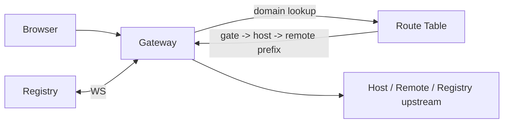

# Gateway

The gateway is the public surface of every Nexus deployment. It terminates incoming requests, proxies them to the right host or remote, and enforces protection. It is written in Rust (axum + hyper) and replaces what was nginx in earlier versions.

Code: `nexus-gateway/`. Stack: Rust, [axum](https://docs.rs/axum), [hyper](https://docs.rs/hyper), [tower-http](https://docs.rs/tower-http).

## What it does



1. Reads its configuration from the registry on startup (`GET /api/config/gateway`).
2. Connects to the registry over WebSocket (`/api/ws`) and subscribes to changes.
3. Builds an in-memory route table keyed by domain.
4. On every incoming request, applies seven protection layers, then resolves the route.
5. Proxies the request to the upstream. Streams the response.
6. On every registry broadcast — `host_changed`, `gate_changed`, `remotes_changed` — recomputes the affected portion of the route table and swaps it atomically.

## Endpoints the gateway owns

| Method | Path | Purpose |
|---|---|---|
| `GET` | `/health` | Liveness. Returns `{ status, registry_connected, framework, ... }`. |
| `GET` | `/metrics` | Prometheus exporter (text format). |
| `GET` | `/ws` | Proxies the registry WebSocket to the browser. |
| `GET/POST/DELETE` | `/api/protection/*` | Manage bans (`status`, `ban`, `ban/{ip}`, `bans`). |

Every other path is matched against the route table; anything that does not match falls through to the SPA fallback handler — which serves the host's `index.html`.

## Bootstrap sequence

```
1. read_env()
   ├─ NEXUS_TOKEN, REGISTRY_URL, PORT, LOG_JSON
2. bootstrap()
   ├─ GET /api/gates/by-domain/{gate-domain}      -> identifies the gate this gateway serves
   ├─ GET /api/hosts/{host_id}                    -> reads the host
   ├─ GET /api/hosts/{host_id}/remotes            -> reads the visible remotes
   ├─ GET /api/config/gateway                     -> CORS, headers, protection
   └─ Build initial RouteTable
3. spawn(registry_listener)
   └─ subscribes to /api/ws, handles host_changed/gate_changed/remotes_changed
4. axum::serve()
   ├─ protection middleware (seven layers)
   ├─ compression layer
   └─ fallback to proxy or SPA
```

If the registry is unreachable on boot, the gateway exits with a non-zero code so your orchestrator restarts it.

## Framework-aware SPA

The gateway ships a vanilla-JavaScript SPA that mounts at `/`. It detects the host's framework from the registry payload (angular / vue / react / auto) and loads the appropriate runtime bridge. This means: even before the host's own bundle ships, the gateway serves a thin SPA that initiates the federation handshake. The user never sees a blank page during cold start.

Configure with `Host.framework` in the registry (set when you create the host). `auto` lets the gateway pick based on which adapter the host's `remoteEntry.json` lists.

## The seven DDoS protection layers

All seven run as a single tower middleware. Every setting is hot-reloaded from `/api/config/gateway/protection` (managed in the portal).

### 1. IP ban list

```
DashMap<IpAddr, BanEntry>
```

Bans are timed. Each `BanEntry` carries `banned_until`, `reason`, and `violation_count`. A banned IP gets `429 Too Many Requests` with `Retry-After: <seconds>` and the body `{ "error": "banned", "reason": ..., "retry_after_seconds": ... }`.

Triggers:
- Manual: `POST /api/protection/ban`.
- Automatic: any IP that exceeds `ban_threshold_violations` violations across the other layers within the violation window.

### 2. Per-IP connection limits

| Setting | Default | Range |
|---|---|---|
| `maxConnectionsPerIp` | 50 | 1 — 10 000 |

Each open HTTP request from an IP increments a counter. When the counter exceeds the limit, the gateway responds with `429`. The counter decrements when the request ends.

### 3. Rate limit (token bucket)

| Setting | Default |
|---|---|
| `rateLimitEnabled` | true |
| `rateLimitRequestsPerSecond` | 100 |
| `rateLimitBurst` | 200 |
| `rateLimitBy` | `ip` |

Per-IP token bucket. Exceeding the rate produces `429` with `Retry-After-Ms`.

### 4. Payload size limits

| Setting | Default |
|---|---|
| `maxBodyBytes` | 1 048 576 (1 MiB) |

Requests with `Content-Length` larger than the cap are rejected with `413 Payload Too Large` before the body is read.

### 5. Header size limits

| Setting | Default |
|---|---|
| `maxHeaderBytes` | 8 192 |

The HTTP parser enforces this. Requests with oversized headers are rejected at the framing layer with `431 Request Header Fields Too Large`.

### 6. Timeouts (including Slowloris detection)

| Setting | Default |
|---|---|
| `requestTimeoutMs` | 30 000 |
| `headerReadTimeoutMs` | 5 000 |
| `bodyReadTimeoutMs` | 10 000 |
| `idleTimeoutMs` | 60 000 |
| `slowlorisTimeoutMs` | 10 000 |

A connection that starts to send headers but doesn't finish within `headerReadTimeoutMs` is dropped. A request whose body trickles in past `bodyReadTimeoutMs` is dropped. Slowloris attacks are caught by the dedicated `slowlorisTimeoutMs` watchdog.

### 7. WebSocket connection limits

| Setting | Default |
|---|---|
| `maxWebsocketConnectionsPerIp` | 5 |

Each open WebSocket from an IP increments a counter. Beyond the cap the upgrade returns `429`.

### Auto-ban

| Setting | Default |
|---|---|
| `banDurationSeconds` | 300 |
| `banThresholdViolations` | 10 |

Layers 2–7 each record a "violation" when they reject a request. When an IP accumulates `banThresholdViolations` violations within the rolling window, the IP is auto-banned for `banDurationSeconds`. The portal shows the live ban list, the top offending IPs, and the violation reasons.

## Custom response headers

`gatewayConfig.customHeaders` ships from the registry. Each item is `{ name, value }`. The gateway adds them to every response — useful for security headers (HSTS, CSP, X-Frame-Options) and gate-specific branding.

## CORS

`gatewayConfig.corsOrigins` is the allowlist. The gateway sends `Access-Control-Allow-Origin` (matching against the request `Origin`), `Vary: Origin`, and the standard CORS headers. Override per-gate by updating the registry — no restart.

## Metrics

`GET /metrics` exposes Prometheus counters:

- `nexus_gateway_requests_total{method,status,upstream}`
- `nexus_gateway_requests_blocked_total{reason,ip_class}` — counts of every protection-layer rejection
- `nexus_gateway_active_connections{kind=http|ws}`
- `nexus_gateway_banned_ips`
- `nexus_gateway_upstream_latency_seconds{upstream}` (histogram)

Scrape interval guidance: 15 seconds for live traffic, 60 seconds otherwise.

## Reading the code

- Entry: `nexus-gateway/src/main.rs`.
- Route table: `nexus-gateway/src/route_table.rs`.
- Protection middleware: `nexus-gateway/src/protection.rs`.
- WebSocket proxy: `nexus-gateway/src/ws_proxy.rs`.
- Registry listener: `nexus-gateway/src/registry_listener.rs`.
- Framework SPA: `nexus-gateway/src/spa.rs`.
- Startup: `nexus-gateway/src/startup.rs`.

## Next

- [Infra: protection](infra-protection.md) — operate the seven layers.
- [Infra: hosts and gates](infra-hosts-and-gates.md) — the model the gateway routes by.
- [Reference: environment](../reference/environment.md) — every env var the gateway honors.
