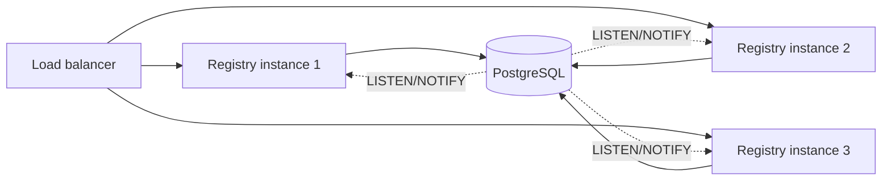

# High availability

This page is honest about what HA looks like in Nexus today and what is on the roadmap. The platform was designed so the path from "single registry instance" to "active-active registry cluster" is a configuration change, not a rewrite.

## What's shipped today

- **SQLite-backed registry.** Single writer, fast reads, durable on a persisted volume. Suitable for a single-region deployment that can tolerate ~30 seconds of read-only fallback while the registry restarts.
- **Stateless gateway.** Multiple gateway instances behind a load balancer is supported and tested. Each gateway maintains its own WebSocket subscription to the registry and its own protection state. Bans are per-instance.
- **Host fallback chain.** Browser-side: live registry → `sessionStorage` cache → static backup JSON. Open browser tabs survive a registry restart with no visible impact.
- **Graceful shutdown.** The registry broadcasts `registry_shutting_down` with a `resume_in_ms` hint before draining HTTP. Clients are expected to back off for that interval.

## What's on the migration path

### PostgreSQL backend

The registry's storage trait is `Db`-shaped (see `nexus-registry/src/store/mod.rs`). The SQLite implementation is the only concrete adapter shipped today. A PostgreSQL adapter is the next storage backend — same schema, same migrations, same query layer.

To preview the migration:

1. Run a PostgreSQL instance with the new schema applied.
2. Export current SQLite contents with `sqlite3 registry.db .dump` and import with `psql`.
3. Set `DATABASE_URL=postgres://...` on the registry.

The portal and gateway do not need to change.

### Multi-instance registry with LISTEN/NOTIFY

Once on PostgreSQL, you can run several registry instances against the same database. The plan:

- Each registry instance subscribes to a PostgreSQL channel (`LISTEN nexus_changes`).
- A `PUT /api/remotes/foo` on instance A commits the change and issues `NOTIFY nexus_changes 'remotes:foo'`.
- Instance B receives the notification, invalidates its cache, and re-fans-out the change to its own WebSocket subscribers.
- All instances see all changes within milliseconds. Load-balance HTTP and WebSocket connections across them.



The active-active design has no leader election, no quorum protocol. PostgreSQL's transactions and `NOTIFY` ordering provide the consistency guarantees.

## How clients survive a registry restart

### Gateway

The gateway's WebSocket reconnect uses exponential backoff with jitter, parameters provided by the registry's `welcome` frame. A registry restart looks like this from the gateway's perspective:

1. WebSocket connection closes.
2. Gateway tries to reconnect: 1 s, 2 s, 4 s, 8 s, … up to `maxDelayMs`.
3. Gateway continues serving existing routes from its in-memory table. No request returns 502 because of the registry being down.
4. When reconnected, the gateway resyncs by calling `GET /api/config/gateway` and `GET /api/hosts/{id}/remotes`.

### Host (browser)

Same WebSocket logic, plus the three-layer fallback for the *initial* fetch:

```
GET /api/remotes
  └─ HTTP error
     └─ read sessionStorage cache (last successful fetch)
        └─ cache miss / corrupt
           └─ fetch staticBackupUrl (a static JSON file)
              └─ all failed: host renders an empty remote list
```

A logged-in user with an open tab survives a 30-minute registry outage without noticing — the cached remotes keep working.

### CLI

`bnx publish`, `bnx status`, `bnx health` retry against the registry with exponential backoff and exit non-zero only after `maxAttempts`. Configure with `--retry-attempts`.

## Disaster recovery

### Lose the registry volume

The registry's SQLite file is the source of truth. Back it up. Restore by stopping the registry, replacing the file, and restarting. Hosts will re-register themselves on their next container restart; gates and hosts come back from the restored file.

Daily snapshots are sufficient for most teams.

### Lose a gateway instance

Replace the container. The new instance bootstraps from the registry in under a second. The load balancer routes traffic to it as soon as `/health` returns ok.

### Lose the entire stack

The registry, the gateway, and the portal are stateless or backed by a single file. A redeploy from your registry's image tags brings everything back. The only state to recover is the registry's SQLite file.

## Testing your HA story

The platform ships a `verify/` folder under `nexus-packages/` with mock servers and chaos scenarios. Use it in CI to confirm your application's runtime survives:

- A 30-second registry outage.
- A gateway restart.
- A token rotation with a 60-second grace period.
- A remote container going away mid-render.

See [packages: nexus-testing](../packages/nexus-testing.md).

## Roadmap

| Item | Status |
|---|---|
| SQLite backend | shipped |
| Multi-instance gateway behind LB | shipped |
| Browser fallback chain (3 layers) | shipped |
| Graceful shutdown coordination | shipped |
| PostgreSQL backend | in design |
| Multi-instance registry via LISTEN/NOTIFY | in design |
| Region-replicated PostgreSQL | future |
| Built-in leader election (Raft) | not planned (PostgreSQL provides ordering) |

Track progress in the GitHub repo's milestones.

## Next

- [Infra: registry](infra-registry.md) — the API surface multiple instances expose.
- [Reference: configuration](../reference/configuration.md) — graceful shutdown and reconnect knobs.
- [Workflows: zero-downtime](../workflows/zero-downtime.md) — deploy individual services without HA impact.
