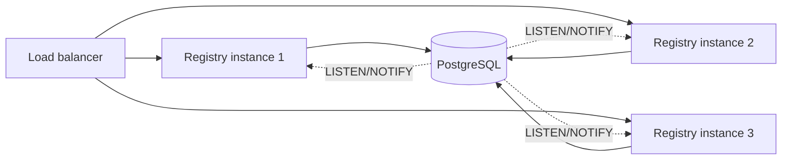

# High availability

Nexus is built to run in clusters. Stateless gateway, replicated registry, browser-side fallback chain — the HA story is the default deployment shape, not a future migration. This page is honest about what HA looks like in Nexus today and what is on the roadmap.

## Deployment shapes

The platform supports three deployment shapes from the same binaries. You pick by configuration.

```
single-node  ───→  replicated  ───→  multi-region
 (dev / staging)   (production HA)   (geo redundancy)
```

| Shape | Gateway | Registry | Database | Operational story |
|---|---|---|---|---|
| **Single node** | 1 instance | 1 instance | SQLite (file on a persisted volume) | Dev, staging, small single-region deployments. Tolerates ~30 s read-only fallback during registry restart. Backup is a file snapshot. |
| **Replicated (production HA)** | N instances behind a load balancer | N instances behind the same load balancer | Postgres, MySQL or MariaDB on a managed cluster | The default production shape. Gateway is stateless and horizontal. Registry replicas share one database — HTTP traffic load-balances cleanly. WebSocket broadcast fan-out across replicas is the only piece pending (see roadmap). |
| **Multi-region** | N per region | N per region | Region-replicated Postgres | Future shape. Gateways serve the closest registry; registry data flows region-to-region through Postgres replication. Active-active read paths, single-leader writes. |

The same image runs in all three. Operators graduate from single-node to replicated by pointing at a clustered database — no code change, no rebuild.

## What's shipped today

- **Stateless gateway, designed for N-up.** Run as many gateway instances as you need behind a load balancer. Each maintains its own WebSocket subscription to the registry and its own protection state. Tested and supported. Bans are per-instance.
- **Multi-engine registry storage.** One binary, four storage backends — SQLite, Postgres, MySQL, MariaDB. The engine is chosen at startup from the connection URL; the schema is identical and created on first boot. See [infra-registry](infra-registry.md#storage) for the URL syntax.
- **SQLite for single-node deployments.** Single writer, fast reads, durable on a persisted volume. Tolerates ~30 seconds of read-only fallback while the registry restarts.
- **Postgres / MySQL / MariaDB for HA.** Run the database on a managed cluster or your own replicated server; the registry container stays stateless. Multiple registry replicas share one database for HTTP traffic out of the box — broadcast fan-out across replicas is the only piece pending (see roadmap).
- **Host fallback chain.** Browser-side: live registry → `sessionStorage` cache → static backup JSON. Open browser tabs survive a 30-minute registry outage with no visible impact.
- **Graceful shutdown.** The registry broadcasts `registry_shutting_down` with a `resume_in_ms` hint before draining HTTP. Clients are expected to back off for that interval.
- **Hot-swap routing.** The gateway recomputes its route table from the registry's WebSocket broadcast and swaps it in atomically. New routes are live within milliseconds of a registry write; in-flight connections are unaffected.

## Migrating from SQLite to Postgres / MySQL / MariaDB

The registry shares one schema and one query layer (sqlx's `Any` driver) across every engine. Switching is a configuration change:

1. Stand up a Postgres / MySQL / MariaDB instance and create an empty database for the registry.
2. Export current SQLite contents — either dump the JSON view via the API (`GET /api/hosts`, `/api/gates`, `/api/remotes`, `/api/config`) and replay it as `POST`/`PUT` against the new registry, or use `sqlite3 registry.db .dump` and run a manual translation.
3. Restart the registry with `DATABASE_URL=postgres://...` (or the matching `DB_*` split vars).
4. The schema is created on first boot. Hosts re-register themselves on their next container restart.

The portal, gateway, and remotes do not need to change.

## What's on the migration path

### Multi-instance registry with LISTEN/NOTIFY

Once you're on Postgres, you can already point multiple registry replicas at the same database for HTTP traffic. The piece pending is broadcast fan-out: changes committed on instance A do not yet reach WebSocket subscribers on instance B until a `LISTEN/NOTIFY` bridge lands.

The plan:

- Each registry instance subscribes to a PostgreSQL channel (`LISTEN nexus_changes`).
- A `PUT /api/remotes/foo` on instance A commits the change and issues `NOTIFY nexus_changes 'remotes:foo'`.
- Instance B receives the notification, invalidates its cache, and re-fans-out the change to its own WebSocket subscribers.
- All instances see all changes within milliseconds. Load-balance HTTP and WebSocket connections across them.



The active-active design has no leader election, no quorum protocol. PostgreSQL's transactions and `NOTIFY` ordering provide the consistency guarantees.

## How clients survive a registry restart

### Gateway

The gateway's WebSocket reconnect uses exponential backoff with jitter, parameters provided by the registry's `welcome` frame. A registry restart looks like this from the gateway's perspective:

1. WebSocket connection closes.
2. Gateway tries to reconnect: 1 s, 2 s, 4 s, 8 s, … up to `maxDelayMs`.
3. Gateway continues serving existing routes from its in-memory table. No request returns 502 because of the registry being down.
4. When reconnected, the gateway resyncs by calling `GET /api/config/gateway` and `GET /api/hosts/{id}/remotes`.

### Host (browser)

Same WebSocket logic, plus the three-layer fallback for the *initial* fetch:

```
GET /api/remotes
  └─ HTTP error
     └─ read sessionStorage cache (last successful fetch)
        └─ cache miss / corrupt
           └─ fetch staticBackupUrl (a static JSON file)
              └─ all failed: host renders an empty remote list
```

A logged-in user with an open tab survives a 30-minute registry outage without noticing — the cached remotes keep working.

### CLI

`bnx publish`, `bnx status`, `bnx health` retry against the registry with exponential backoff and exit non-zero only after `maxAttempts`. Configure with `--retry-attempts`.

## Disaster recovery

### Lose the registry's storage

Whichever engine you chose owns the source of truth. Back it up:

- **SQLite**: snapshot the file (`/app/data/registry.db`) on a cadence that matches your RPO.
- **Postgres / MySQL / MariaDB**: rely on the database's own backup / WAL / binlog setup — the same one your operations team already runs.

Restore by stopping the registry, restoring the storage, and starting the registry again. Hosts re-register themselves on their next container restart; gates and hosts come back from the restored database.

Daily snapshots are sufficient for most teams.

### Lose a gateway instance

Replace the container. The new instance bootstraps from the registry in under a second. The load balancer routes traffic to it as soon as `/health` returns ok.

### Lose the entire stack

The registry, the gateway, and the portal are stateless or backed by a single database. A redeploy from your registry's image tags brings everything back. The only state to recover is the registry's storage — the SQLite file or the dump from your Postgres / MySQL / MariaDB.

## Testing your HA story

The platform ships a `verify/` folder under `nexus-packages/` with mock servers and chaos scenarios. Use it in CI to confirm your application's runtime survives:

- A 30-second registry outage.
- A gateway restart.
- A token rotation with a 60-second grace period.
- A remote container going away mid-render.

See [packages: nexus-testing](../packages/nexus-testing.md).

## Roadmap

| Item | Status |
|---|---|
| SQLite backend | shipped |
| Postgres backend | shipped |
| MySQL / MariaDB backend | shipped |
| Multi-instance gateway behind LB | shipped |
| Browser fallback chain (3 layers) | shipped |
| Graceful shutdown coordination | shipped |
| Multi-instance registry via LISTEN/NOTIFY | in design |
| Region-replicated Postgres | future |
| Built-in leader election (Raft) | not planned (Postgres provides ordering) |

Track progress in the GitHub repo's milestones.

## Next

- [Infra: registry](infra-registry.md) — the API surface multiple instances expose.
- [Reference: configuration](../reference/configuration.md) — graceful shutdown and reconnect knobs.
- [Workflows: zero-downtime](../workflows/zero-downtime.md) — deploy individual services without HA impact.
