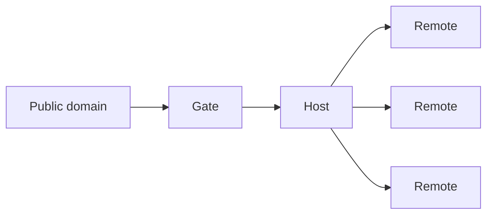
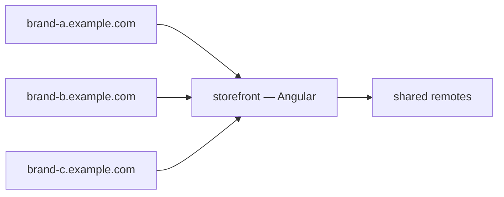
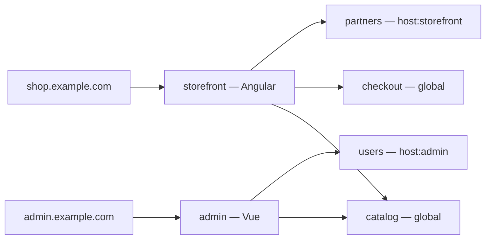
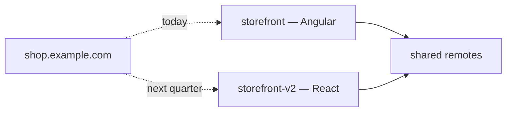
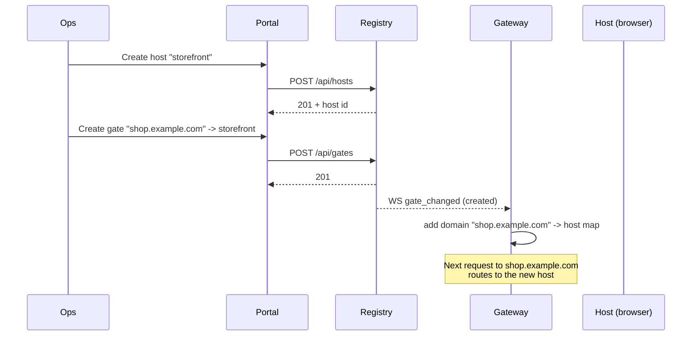

# Hosts and gates

This page is the conceptual guide to the three-entity model. Read it once and the rest of the platform stops feeling like a collection of features and starts feeling like one tool.

## The three entities



- **Gate** — a public domain. Owned by ops.
- **Host** — a shell application. Owned by a platform team.
- **Remote** — a micro frontend. Owned by a product team.

A gate points to exactly one host. A host can be referenced by many gates. A remote can be visible to all hosts (`global`) or pinned to one (`host:<id>`).

## When to create a new gate

Create a gate when you need:

- A new domain (`shop.example.com`, `admin.example.com`).
- A new subdomain that should behave like a separate product (`partner.example.com`).
- A staging or preview environment with the same code as production but a different surface.
- A white-label deployment that wraps the same host with different headers or CORS settings.

A gate is cheap. Create one whenever your operational story needs a separate URL.

## When to create a new host

Create a host when:

- You're standing up a new application with its own framework choice (Angular, Vue, or React).
- You want a fundamentally different shell layout that cannot be expressed by toggling remotes.
- A new product needs an entirely different remote-visibility scope.

A host is more expensive than a gate — it's an entire application build pipeline. Default to reusing an existing host with gates.

## Common patterns

### One host, many domains (white-label)



Three brands, one application. Each gate has its own `customHeaders` for branding-relevant headers (CSP, content-language, og:image hostname). The `host` URL behind each gate detects the requested domain via the standard `Host` header and adjusts theming at render time.

Set up: [workflows: multi-domain-setup](../workflows/multi-domain-setup.md).

### Two hosts (storefront + admin)



The catalog remote is shared. `partners` is locked to the storefront. `users` is locked to admin. Both hosts run different framework codebases; both see the same catalog.

### One host, framework migration



Plan a migration by standing up the new host (in a different framework if desired), pointing a *new* gate to it for testing, and finally updating the production gate to the new host when you're ready. The change is atomic — the gateway hot-swaps routing in milliseconds. Rollback is changing the gate back.

## How visibility works

When a host fetches its remote list, the registry returns:

- Every remote whose `visibility == "global"`.
- Every remote whose `visibility == "host:<this_host_id>"`.

Other host-specific remotes are filtered out. The host literally never sees them, so nothing can leak across applications by accident.

```ts
// Visibility is set when the remote registers itself.
// In Angular:
provideNexusRemote({
  entry: AppComponent,
  configDefaults: { visibility: 'host:01HXY...' },   // host-specific
})

// In Vue / React:
registerNexusRemote({
  name: 'users',
  url: '/remoteEntry.json',
  routePath: 'users',
  visibility: 'host:01HXY...',
})
```

Default is `global` for back-compat with single-host deployments. Lock down by setting visibility explicitly.

## The portal flow



The same flow for remotes is identical — POST `/api/remotes`, registry broadcasts `remotes_changed`, gateway updates its route table, every host browser tab learns about the new route.

## Migration tip — handle the `host_reassigned` broadcast

Moving a gate from one host to another fires `gate_changed` with `trigger: "host_reassigned"`. The gateway swaps the host upstream in its routing table. Open browser tabs on that gate will continue serving the old host's bundles until the user navigates to a new route — at which point the new host bundles load. This is intentional: it avoids dropping in-flight requests.

If you need to force a refresh of every open tab, broadcast a custom signal via the registry's `config_changed` channel and have the host's runtime react.

## Reading the code

- Registry hosts API: `nexus-registry/src/api/hosts.rs`.
- Registry gates API: `nexus-registry/src/api/gates.rs`.
- Visibility filtering: `nexus-registry/src/store/sqlite.rs` (`list_for_host`).
- Gateway gate resolution: `nexus-gateway/src/startup.rs` and `nexus-gateway/src/registry_listener.rs`.

## Next

- [Workflows: hosts-and-gates-setup](../workflows/hosts-and-gates-setup.md) — step-by-step setup.
- [Workflows: multi-domain-setup](../workflows/multi-domain-setup.md) — white-label patterns.
- [Infra: registry](infra-registry.md) — the underlying API.
