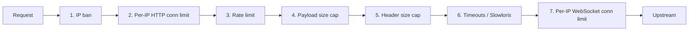

# DDoS protection

The Nexus gateway ships seven protection layers, all hot-configurable from the portal's **Protection** page. This guide is the operator's playbook: what each layer protects against, how to tune it, and how to read the dashboard during an incident.

## The seven layers



| # | Layer | Default cap | Reject status |
|---|---|---|---|
| 1 | IP ban list | none | 429 + `Retry-After` |
| 2 | Per-IP HTTP connections | 50 | 429 |
| 3 | Rate limit (token bucket) | 100 req/s, burst 200 | 429 + `Retry-After-Ms` |
| 4 | Max body bytes | 1 MiB | 413 |
| 5 | Max header bytes | 8 192 | 431 |
| 6 | Slowloris / read timeouts | 5–30 s depending on phase | 408 / connection drop |
| 7 | Per-IP WebSocket connections | 5 | 429 |

Every rejection records a violation. Violations accumulate per IP; when an IP exceeds `banThresholdViolations` (default 10), it is auto-banned for `banDurationSeconds` (default 300 s = 5 min).

## The Protection page

Open `http://<portal>/protection`. You see:

- **Live counters** — total requests blocked since start, active bans, total active HTTP and WS connections.
- **Top offenders** — table of IPs ranked by violation count, with their current HTTP and WS connection counts and ban status.
- **Active bans** — every banned IP, its remaining ban duration, the reason, and an `Unban` button.
- **Sparklines** — `requests_blocked_total` and connection counts over the last hour.
- **Settings editor** — every protection knob, with live validation. Changes PUT to `/api/config/gateway/protection` and take effect immediately.

## Operations playbook

### A new attacker shows up

1. Refresh **Top offenders**. An IP with high violation count and many active connections is suspect.
2. Click **Ban** on that row. The gateway adds the IP to the ban map within milliseconds.
3. If you see *many* IPs (botnet), tighten layer 3 — drop `rateLimitRequestsPerSecond` from 100 to 30 temporarily.
4. Watch the sparkline. The `requests_blocked` line should rise and then stabilize.

### Legitimate user got auto-banned

1. Find them in **Active bans**.
2. Click **Unban**. The IP is removed.
3. Raise `banThresholdViolations` if this keeps happening — your threshold is too tight for your traffic.

### Slowloris attempt

You'll see violations under reason `slowloris` or `header_read_timeout` in the metrics. Drop `headerReadTimeoutMs` and `slowlorisTimeoutMs` together — both must finish before the attacker can hold sockets open.

### WebSocket flood

Each connection holds a tokio task. If `nexus_gateway_active_connections{kind="ws"}` is climbing without bound, lower `maxWebsocketConnectionsPerIp` and watch the rate of rejected upgrades.

## API for automation

If you'd rather automate (e.g., from a SIEM):

```bash
# List current bans + top offenders + counters
curl -H "X-Nexus-Token: $NEXUS_TOKEN" http://localhost:8668/api/protection/status

# Manual ban (300-second default duration; override with duration_seconds)
curl -X POST -H "X-Nexus-Token: $NEXUS_TOKEN" \
  -H "Content-Type: application/json" \
  -d '{"ip":"203.0.113.4","duration_seconds":3600}' \
  http://localhost:8668/api/protection/ban

# Unban
curl -X DELETE -H "X-Nexus-Token: $NEXUS_TOKEN" \
  http://localhost:8668/api/protection/ban/203.0.113.4

# Clear all bans
curl -X DELETE -H "X-Nexus-Token: $NEXUS_TOKEN" \
  http://localhost:8668/api/protection/bans
```

## Metrics for dashboards

From `GET /metrics` (Prometheus format):

| Metric | Type | Labels |
|---|---|---|
| `nexus_gateway_requests_blocked_total` | counter | `reason`, `ip_class` |
| `nexus_gateway_banned_ips` | gauge | — |
| `nexus_gateway_active_connections` | gauge | `kind=http|ws` |
| `nexus_gateway_violations_total` | counter | `reason` |
| `nexus_gateway_upstream_latency_seconds` | histogram | `upstream` |

`ip_class` is `private` (RFC1918), `loopback`, or `public` — useful for filtering out monitoring traffic that comes from inside your VPC.

## Tuning targets

A reasonable starting point for a public-facing storefront:

| Setting | Value |
|---|---|
| `rateLimitRequestsPerSecond` | 60 |
| `rateLimitBurst` | 120 |
| `maxConnectionsPerIp` | 30 |
| `maxWebsocketConnectionsPerIp` | 3 |
| `requestTimeoutMs` | 20 000 |
| `headerReadTimeoutMs` | 3 000 |
| `slowlorisTimeoutMs` | 5 000 |
| `banDurationSeconds` | 900 |
| `banThresholdViolations` | 5 |

Adjust after a week of real traffic. Always tighten before you actually need it — auto-ban only catches IPs that *keep* misbehaving; the first violations slip through.

## Next

- [Workflows: protection-setup](../workflows/protection-setup.md) — checklist for initial configuration.
- [Infra: gateway](infra-gateway.md) — the layers in detail.
- [Infra: prometheus-metrics](infra-prometheus-metrics.md) — what to graph.
