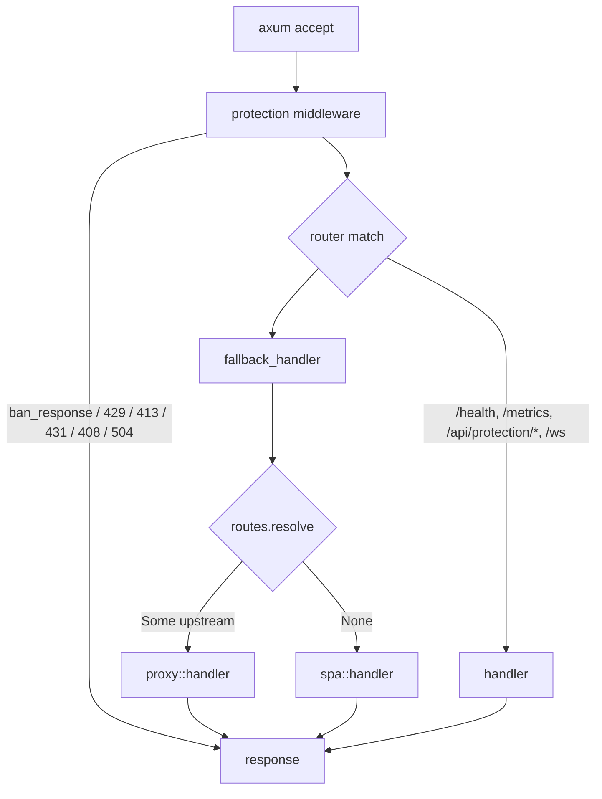

# Gateway internals — architecture

For tenants the gateway is a black box documented under [infrastructure/gateway](../../infrastructure/infra-gateway.md). This page is for the person who has to change its code.

Code: `nexus-gateway/`. Stack: Rust 2021, [axum 0.7](https://docs.rs/axum/0.7), [hyper 1](https://docs.rs/hyper/1), [tokio](https://tokio.rs), [tokio-tungstenite](https://docs.rs/tokio-tungstenite), [dashmap](https://docs.rs/dashmap), [tower-http](https://docs.rs/tower-http), [prometheus](https://docs.rs/prometheus).

## Process model

A single `#[tokio::main]` runtime. Three long-lived task families:

1. **HTTP server** — `axum::serve(...)`. Each accepted connection is a task; each request runs through the protection middleware then a handler.
2. **Registry listener** — one `tokio::spawn` started from `main`. Reconnect loop over `tokio_tungstenite::connect_async`; handles `WsMessage` variants from the registry.
3. **Proxied WebSocket** — one short-lived task per browser WS upgrade. `ws_proxy::pipe` runs two `tokio::spawn` (`c2u`, `u2c`) and joins on first close.

There is no per-request task pool; the runtime's executor scales naturally. There is no explicit shutdown channel — when the process gets SIGTERM, axum drops connections; the registry listener and WS pipes exit when their sockets are closed by the runtime.

## Shared state

```text
AppState  ────────────────────────  cloned into every handler
 ├─ gateway:  SharedState  = Arc<RwLock<GatewayState>>      (tokio::sync::RwLock)
 ├─ routes:   RouteTable   = Arc<DashMap<String, UpstreamTarget>>
 ├─ proxy_client: hyper_util Client<HttpConnector, Full<Bytes>>
 ├─ http_client:  hyper_util Client used for registry GETs/POSTs
 └─ protection: SharedProtection = Arc<ProtectionState>
                ├─ connections: DashMap<IpAddr, ConnectionCount>
                ├─ bans:        DashMap<IpAddr, BanEntry>
                ├─ violations:  DashMap<IpAddr, ViolationRecord>
                ├─ rate_limits: DashMap<IpAddr, Mutex<TokenBucket>>    (parking_lot::Mutex)
                └─ requests_blocked: AtomicU64
```

Concurrency rules — **respect these when adding code**:

- `GatewayState` is wrapped in `tokio::sync::RwLock`. Always hold the guard for the minimum time. Never `await` while holding a write guard; never call into the registry while holding any guard.
- `RouteTable` is lock-free (`DashMap`). Cloneable; shared across tasks. Read with `resolve`, mutate with `upsert`/`remove`/`clear_remotes`/`clear`.
- `ProtectionState` uses `AtomicU32`/`AtomicU64` counters plus `DashMap`. The `parking_lot::Mutex` inside `TokenBucket` is short-held and never crosses an `await` point.
- Connection counters increment on entry and decrement at the end of the protection middleware (HTTP) or via `WsGuard::drop` (WebSocket). Adding an early-return branch in protection.rs that bypasses the counter decrement leaks a slot per request.

## Bootstrap

`main` → `startup::read_env()` → `startup::bootstrap()` → `AppState` is built → axum router is composed → `tokio::spawn(registry_listener::run)` → `axum::serve` blocks forever.

```text
startup::read_env()
  └─ requires NEXUS_TOKEN, REGISTRY_URL, NEXUS_GATE_NAME
     optional NEXUS_HOST_NAME, NEXUS_HOST_URL, NEXUS_HOST_FRAMEWORK,
              NEXUS_HOST_REMOTE_ENTRY, NEXUS_HOST_EXPOSED_MODULE,
              NEXUS_GATE_LABEL  (used by auto-registration only)

startup::bootstrap(&env)
  1. GET  /api/gates/by-domain/{NEXUS_GATE_NAME}
       └─ on 404: ensure_gate (find-or-create host, then create gate)
              then poll the same URL with exponential backoff (1s→30s, 60s budget)
  2. GET  /api/hosts/{host_id}/remotes   (only if gate has a host)
  3. GET  /api/config/gateway            (non-fatal — falls back to defaults)
  4. Return GatewayState + initial RouteTable
       (always upserts /host/ → host_url; remotes whose visibility passes is_visible)
```

If any step exits with `Err`, `main` prints the error and `exit(1)`. There is no in-process retry past the bootstrap budget — your orchestrator restarts the container.

## Registry listener

`registry_listener::run` is the only task that watches the registry. It:

1. Builds `wss://.../api/ws?token=<NEXUS_TOKEN>` (or `ws://`).
2. `connect_async`. Sets `state.registry_connected = true`.
3. Sends `{"type":"subscribe_gate","gate_name":...}` so the registry can scope broadcasts.
4. Stream loop dispatches incoming `WsMessage` variants:
   - `RemotesChanged` → `routes.clear_remotes()` then upsert each visible remote.
   - `HostChanged` → ignores if `host.id != state.host_id`. Patches `host_url`, `host_framework`, `host_remote_entry`, `host_exposed_module`. Also upserts `/host/`.
   - `GateChanged` → ignores if not our gate. Re-fetches the full gate over HTTP because the WS payload only carries the id. Rebuilds the route table from scratch via `startup::build_route_table`. This is how host reassignment lands.
   - `ConfigChanged { section: "gateway_protection", value }` → swaps `state.gateway_config.protection`. Other sections are ignored.
   - `ReconnectPolicyChanged { policy }` → updates `base_delay` / `max_delay` (used by *this* loop's reconnect backoff, not by anything else).
5. On disconnect: `state.registry_connected = false`, sleep with jitter `0..=500ms`, retry. Backoff is `base_delay * 2` capped at `max_delay`.

The route table is **never rebuilt from a partial WS payload**. Either a full `RemotesChanged` arrives, or a `GateChanged` triggers a full HTTP re-fetch and rebuild. This keeps `RouteTable` in a definite state at every step.

## Request lifecycle



Everything other than the explicit routes (`/health`, `/ws`, `/metrics`, `/api/protection/*`) falls through to `fallback_handler`, which uses `RouteTable::resolve` (longest-prefix match) to decide between proxy and SPA. Disabled targets are skipped by `resolve` and fall through to the SPA.

## Protection middleware (the seven layers)

Order matters. It is encoded once in `protection::middleware` and must not be reordered without thinking about which signal each layer produces.

| Order | Layer | Where in code | Rejects with |
|---|---|---|---|
| 1 | IP ban check | `check_ban` | 403 `ip_banned`, `retry-after` set |
| 5 | Header size | sum of `(k.len + v.len + 4)` | 431 `headers_too_large` |
| 4a | `Content-Length` pre-check | `content_length(&req)` | 413 `payload_too_large` |
| 2 | Per-IP concurrent HTTP connections | `connections` counter | 429 `too_many_connections` |
| 3 | Token-bucket rate limit | `try_rate_limit` | 429 `rate_limited`, `retry-after` set |
| 6 | Body read timeout | `body_timeout` inside outer `tokio::time::timeout` | 408 `request_timeout` |
| 7 | Total request timeout | outer `tokio::time::timeout` | 504 `gateway_timeout` |
| 4b | Streaming body size (POST/PUT/PATCH) | post-collect check | 413 `payload_too_large` |

Layer 7 (WebSocket connection cap) is enforced separately in the `/ws` handler before `ws.on_upgrade`, with a `WsGuard` ensuring decrement on disconnect.

**Auto-ban funnel:** layers 2–6 call `record_violation(ip, reason, cfg)` on every rejection. When an IP's running violation count crosses `cfg.ban_threshold_violations`, the IP is auto-inserted into `bans` with `cfg.ban_duration_seconds`. Layer 1 then short-circuits subsequent requests from the same IP. There is no rolling-window reset; the `ViolationRecord.first_seen` is captured but not currently used to expire counts — bans simply expire and counts continue accumulating.

**Client IP source** (`client_ip` helper): trusts `X-Forwarded-For` and takes the **rightmost** entry (the value added by your trusted L4/L7 in front of the gateway). Spoofed `X-Forwarded-For` prepended by a client is ignored because we never look at the leftmost entry. If no header is present, the socket peer IP is used.

## Proxy path

`proxy::handler` strips the matched prefix, builds the upstream URL, copies the body, forwards. It adds three request headers before sending:

- `X-Forwarded-For: <client ip>`
- `X-Nexus-Gateway: true`
- `X-Request-Id: <ulid>` (only if the client didn't already set one)

Response side: every byte of the upstream body is collected before being sent downstream (no streaming yet). The gateway then:

1. Sets `Cache-Control` from `headers::cache_control_value`:
   - `remoteEntry.json` / `remoteEntry.js` → `no-store, no-cache, must-revalidate` + `Pragma: no-cache`.
   - `/assets/*.js|*.css|*.woff2` → `public, max-age=31536000, immutable`.
   - Everything else → `no-cache`.
2. Layers `apply_custom_headers` from registry-provided `customHeaders` (silently skipped if they overlap with a locked security header).
3. Layers `apply_security_headers`: `X-Frame-Options: SAMEORIGIN`, `X-Content-Type-Options: nosniff`, `X-XSS-Protection`, `Referrer-Policy`, `Permissions-Policy`. These five are locked — `customHeaders` cannot override them.

Errors at any step return `502 bad_gateway` or `400 body_read_error` with a JSON body containing a fresh `correlationId`.

## SPA fallback

`spa::handler` is reached when nothing else matched. It injects a JSON config block as a `<script>` tag into one of two static HTML templates baked into the binary at compile time:

- `static/index.html` — when `host_remote_entry` is set (a host is bound to this gate).
- `static/not-ready.html` — when the gate has no host yet (early bootstrap, or a misconfiguration).

The injected JSON is sanitized — `</` is rewritten to `<\/` — so a value containing `</script>` cannot close the script tag. This is the XSS path the audit closed (SEC-2).

The `host_framework` field is included so the static SPA can decide which adapter to import (`auto` lets it detect from the host's `remoteEntry.json`).

## WebSocket proxy

`/ws` upgrades the client and pipes it through `ws_proxy::pipe_socket` to the registry. Two spawned tasks: client→upstream and upstream→client. The pipe uses an axum↔tungstenite message translator (`axum_to_tung` / `tung_to_axum`); `Close` frames are normalized, `Frame` (raw) maps to a clean `Close`.

The WS path has its own concurrency cap (`maxWebsocketConnectionsPerIp`, default 5). It is enforced *before* the upgrade response, and a `WsGuard` (RAII) decrements the counter on drop — even if the pipe task panics or returns early.

## Token auth

`/api/protection/*` endpoints require `X-Nexus-Token`. The check is `constant_time_eq` (XOR-accumulation, no early return on byte mismatch) and the expected token is read fresh per request from `state.nexus_token`. If rotation happens upstream (the registry currently broadcasts `token_rotated` over the WS but the gateway does not yet hot-reload its own copy), restart the gateway.

## Observability

- **Logs:** `tracing` + `tracing-subscriber`. JSON layer when `LOG_JSON=1` / `true`, otherwise human format. Filter via `RUST_LOG`.
- **Metrics:** prometheus, scraped at `GET /metrics`. Counters init at startup so they appear with `0` before the first request. Path cardinality is bounded by `metrics::path_pattern` (collapses dynamic segments into fixed buckets). Client IPs are bucketed by `ip_class` (IPv4: first two octets; IPv6: first segment) to avoid label explosion *and* avoid logging full client IPs.
- **Correlation:** every JSON error body and every proxy request carries a ULID `correlationId` / `x-request-id`. The gateway does not propagate the registry's `cid` — that's a one-process scope.

## Invariants

Things the code currently relies on that aren't expressed as types:

1. The registry serializes everything camelCase. All `RegistryXxx` types in `state.rs` use `#[serde(rename_all = "camelCase")]`. Adding a new field requires both the registry side and the gateway side to agree on case; default to camelCase here.
2. `WsMessage` is `#[serde(tag = "type", rename_all = "snake_case")]`. The registry uses snake_case for the tag (`remotes_changed`, `host_changed`, etc.). Adding a new variant means adding it both here and in `nexus-registry/src/ws/messages.rs`.
3. The route table uses string-prefix keys like `/host/` and `/remotes/<route-path>/`. The trailing slash matters — `resolve` uses `str::starts_with` and longest-prefix wins. Don't add keys without trailing slash unless you mean it.
4. The gateway re-fetches the full gate on every `GateChanged` event. It does not trust partial payloads, ever.
5. Locked security headers (in `headers.rs`) cannot be overridden by `customHeaders`. The portal does not warn the user about this — they will see their custom HSTS value not appearing if it conflicts. Document this in the portal if changed.
6. Bootstrap is fatal-or-success; there is no partial-startup mode. If you add a new optional registry dependency, treat it the same way as `/api/config/gateway` — warn and fall back to defaults.

## Adjacent reading

- [Code map](./code-map.md) — file-by-file index.
- [Infrastructure: gateway](../../infrastructure/infra-gateway.md) — tenant-facing overview.
- [Infrastructure: protection](../../infrastructure/infra-protection.md) — how operators tune the seven layers.
- [Internals: registry](../nexus-registry/architecture.md) — the only service this gateway talks to.
