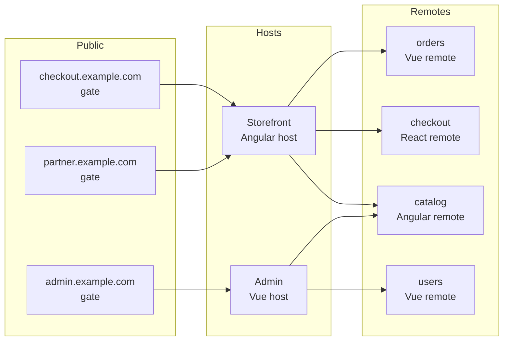
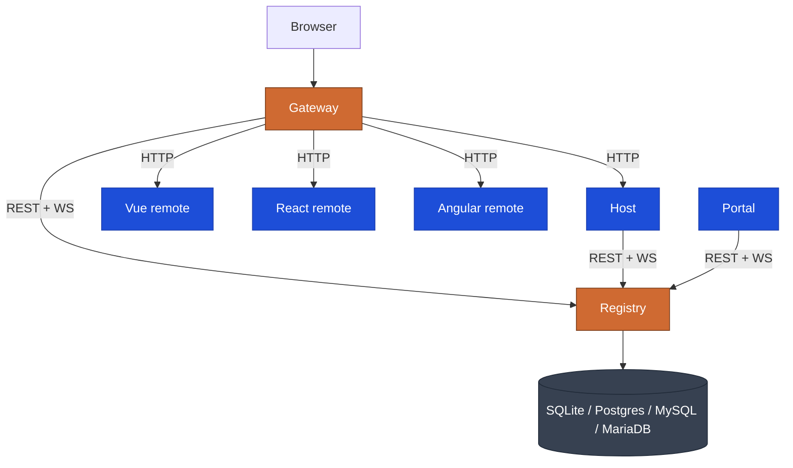

# Nexus

> **The production micro frontend platform for Angular, Vue, and React.**
> One Rust-powered registry. One Rust-powered gateway. Unlimited applications. Dual-licensed AGPL-3.0-or-later or commercial.

Every other micro frontend tool solves one half of the problem. The build-time half (Module Federation) or the routing half (single-spa) or the components half (Bit). Nexus solves the *complete* problem: a Rust registry that hosts, gates and remotes register against; a Rust gateway that builds its proxy table from that registry at runtime; an admin portal; built-in DDoS protection; and adapter packages so an Angular host can load a Vue remote and a React remote in the same browser tab.

<div className="nexus-stat">
  <div className="stat"><div className="num">3</div><div className="label">Frameworks (Angular, Vue, React)</div></div>
  <div className="stat"><div className="num">~12 MB</div><div className="label">Registry RSS at idle</div></div>
  <div className="stat"><div className="num">~20 ms</div><div className="label">Registry cold start</div></div>
  <div className="stat"><div className="num">7</div><div className="label">DDoS protection layers</div></div>
  <div className="stat"><div className="num">0</div><div className="label">Restarts to add a remote</div></div>
</div>

```bash
git clone https://github.com/Bimo-dk/nexus.git && cd nexus
docker compose up --build
# Application: http://localhost:8668
# Portal:      http://localhost:8669
```

---

## Without Nexus vs. with Nexus

The same outcome — a Vue micro frontend, mounted at `/checkout`, registered with a runtime registry.

```ts
// Without Nexus — you write all of this, every time, per remote.
//  1. A bespoke federation manifest (federation.config.json or webpack config)
//  2. A bootstrap that fetches the manifest, parses it, loads each remote module
//  3. A WebSocket client with exponential backoff
//  4. A fallback chain when the registry is down (cache + static backup)
//  5. A token interceptor on every fetch
//  6. nginx config that has to be regenerated every time you add a remote
//  7. A CORS layer
//  8. A health-check loop
//  9. A metrics scrape endpoint
// 10. A loader that handles framework boundaries (Vue inside Angular host)
```

```ts
// With Nexus — the entry file for the same Vue remote, in full:
import { createApp } from 'vue';
import { registerNexusRemote } from '@bimo-dk/nexus-runtime-vue';
import App from './app.vue';

registerNexusRemote({
  name: 'checkout',
  url: `${window.location.origin}/remoteEntry.json`,
  exposedModule: './RemoteEntry',
  routePath: 'checkout',
});

createApp(App).mount('#app');
```

That is the whole file. The decorator on the entry component (`@NexusComponent`) takes care of the catalog metadata. The Vite plugin (`nexusVite`) emits `remoteEntry.json`. Everything else — registration, route propagation, gateway proxy, cache headers, fallback — is the platform doing its job.

### Cross-framework components

A Vue host loads a React component; a React host loads a Vue component. The convention is one exported function per remote — `mount(el: HTMLElement): () => void`. The remote brings its own React or Vue or Angular runtime inside the host's div. No runtime sharing. No `useState` dispatcher bug. The full pattern, including the legacy fallback for same-framework loading, is in the [cross-framework guide](guides/guide-cross-framework.md).

---

## Quick start in any of the three frameworks

Every quick start ships an end-to-end working remote, registered with the Nexus registry, in under five minutes.

### Angular remote

```ts
// src/app/remote-entry/entry.component.ts
import { Component } from '@angular/core';
import { NexusRemote, NexusComponent } from '@bimo-dk/nexus-build';

@NexusRemote()
@NexusComponent({ title: 'Checkout', category: 'commerce' })
@Component({ standalone: true, selector: 'app-checkout', template: '<h1>Checkout</h1>' })
export default class CheckoutComponent {}
```

```ts
// src/main.ts
import { bootstrapApplication } from '@angular/platform-browser';
import { provideNexusRemote } from '@bimo-dk/nexus-runtime';
import CheckoutComponent from './app/remote-entry/entry.component';

bootstrapApplication(CheckoutComponent, {
  providers: [provideNexusRemote({ entry: CheckoutComponent })],
});
```

Full guide: [Angular remote in 5 minutes](getting-started/quick-start-angular.md).

### Vue remote

```ts
// vite.config.ts
import { defineConfig } from 'vite';
import vue from '@vitejs/plugin-vue';
import { nexusVite } from '@bimo-dk/nexus-build/vite';

export default defineConfig({
  plugins: [
    vue(),
    nexusVite({ name: 'checkout', exposes: { RemoteEntry: './src/entry.vue' } }),
  ],
});
```

```ts
// src/main.ts
import { createApp } from 'vue';
import { registerNexusRemote } from '@bimo-dk/nexus-runtime-vue';
import App from './app.vue';

registerNexusRemote({ name: 'checkout', url: '/remoteEntry.json', exposedModule: './RemoteEntry', routePath: 'checkout' });
createApp(App).mount('#app');
```

Full guide: [Vue remote in 5 minutes](getting-started/quick-start-vue.md).

### React remote

```ts
// vite.config.ts
import { defineConfig } from 'vite';
import react from '@vitejs/plugin-react';
import { nexusVite } from '@bimo-dk/nexus-build/vite';

export default defineConfig({
  plugins: [
    react(),
    nexusVite({ name: 'checkout', exposes: { RemoteEntry: './src/entry.tsx' } }),
  ],
});
```

```tsx
// src/main.tsx
import React from 'react';
import ReactDOM from 'react-dom/client';
import { registerNexusRemote } from '@bimo-dk/nexus-runtime-react';
import App from './app.js';

registerNexusRemote({ name: 'checkout', url: '/remoteEntry.json', exposedModule: './RemoteEntry', routePath: 'checkout' });
ReactDOM.createRoot(document.getElementById('root')!).render(<App />);
```

Full guide: [React remote in 5 minutes](getting-started/quick-start-react.md).

---

## One registry, the entire frontend estate

A single Nexus registry instance manages:

- Unlimited **hosts** — shell applications in any of the three frameworks.
- Unlimited **gates** — public domains. Many gates can point to the same host, so multi-tenant or multi-brand sites share one application.
- Unlimited **remotes** — micro frontends. A remote is either *global* (every host can use it) or *host-specific* (locked to one host).



Three public domains. Two host applications written in different frameworks. One catalog remote shared across both. The operator changes any of it from the portal — no rebuild, no restart.

---

## Why Rust under the hood

The previous Node/Express implementation of the registry and the nginx implementation of the gateway both worked. We replaced them anyway, because at platform scale the cost is paid every day.

| Metric | Before (Node / nginx) | After (Rust) | Why it matters |
|---|---|---|---|
| Registry RSS at idle | 80–120 MB | 5–15 MB | A platform instance fits inside a side-car. |
| Registry cold start | ~800 ms | ~20 ms | Faster recovery from rolling restarts. |
| Gateway request latency p99 | nginx reload pauses | sub-millisecond hot-swap | Routes change without a single dropped connection. |
| WebSocket fan-out | event-loop bound | `tokio` task per connection | Tens of thousands of concurrent subscribers per instance. |
| Config reload | edit nginx.conf + reload | API call, hot-applied | The portal can change behavior at runtime. |

These are measurements, not slogans. See [infra-high-availability](infrastructure/infra-high-availability.md) for the test methodology.

---

## What the platform is made of



| Component | Stack | What it does |
|---|---|---|
| Gateway | Rust + axum + hyper | Public ingress. Builds its proxy table from the registry. Seven DDoS layers. |
| Registry | Rust + axum + sqlx | Source of truth for hosts, gates, remotes, and all runtime config. |
| Portal | Angular 19 | Admin UI. Manages every entity, every config, every protection setting. |
| Hosts | Angular 19, Vue 3, React 18 | Shell applications. Load remotes at runtime. |
| Remotes | Angular 19, Vue 3, React 18 | Micro frontends. Register themselves at startup. |
| Packages | `@bimo-dk/nexus-*` (10 packages) | Adapter SDKs, decorators, build plugins, CLI, test utilities. |

---

## Features

<div className="nexus-grid">
  <div className="nexus-card">
    <h3>Multi-framework</h3>
    <p>Angular 19, Vue 3, React 18. Mixed-stack hosts are first class.</p>
  </div>
  <div className="nexus-card">
    <h3>Rust-powered</h3>
    <p>Registry and gateway in Rust. Sub-millisecond hot-route swap.</p>
  </div>
  <div className="nexus-card">
    <h3>Multi-domain via gates</h3>
    <p>Many public domains, one application. Per-domain branding, per-domain headers.</p>
  </div>
  <div className="nexus-card">
    <h3>DDoS protection built in</h3>
    <p>Seven layers: IP bans, connection limits, rate limits, payload caps, header caps, timeouts, WebSocket caps.</p>
  </div>
  <div className="nexus-card">
    <h3>Live configuration</h3>
    <p>Every protection setting, every rate limit, every breaker is hot-reloadable from the portal.</p>
  </div>
  <div className="nexus-card">
    <h3>Prometheus metrics</h3>
    <p>Native /metrics on both registry and gateway. Drop into your dashboards.</p>
  </div>
  <div className="nexus-card">
    <h3>High availability</h3>
    <p>Single binary, four storage engines: SQLite, Postgres, MySQL, MariaDB. Multi-instance registry on Postgres for HA without code change.</p>
  </div>
  <div className="nexus-card">
    <h3>Zero-downtime deploys</h3>
    <p>Cache headers and route hot-swap let you ship a remote without dropping a request.</p>
  </div>
  <div className="nexus-card">
    <h3>Component catalog</h3>
    <p>@NexusComponent (or the catalog field on nexusVite) publishes a discoverable component inventory. The portal renders it as a sortable table with per-component detail pages, copy-able snippets for every host framework, and a live preview.</p>
  </div>
  <div className="nexus-card">
    <h3>Cross-framework via BYOF</h3>
    <p>Every remote ships a tiny <code>mount(el)</code> function. A Vue host loads a React component without sharing React. A React host loads a Vue component without sharing Vue. See the <a href="guides/guide-cross-framework">cross-framework guide</a>.</p>
  </div>
  <div className="nexus-card">
    <h3>CLI scaffolding</h3>
    <p><code>bnx init</code> bootstraps a workspace with multiple gateway stacks. <code>bnx generate host / remote / component</code> scaffolds every artifact. <code>bnx dev --env &lt;stack&gt;</code> picks which environment to develop against.</p>
  </div>
</div>

---

## Where to next

- **[Local dev mode — step by step](workflows/dev-mode.md)** — full walkthrough from `bnx init` to seeing your remote in the portal, with screenshots and diagrams.
- **[Read the Angular quick start](getting-started/quick-start-angular.md)** — five minutes from `git clone` to a running remote.
- **[Read the Vue quick start](getting-started/quick-start-vue.md)** — five minutes from `git clone` to a running remote.
- **[Read the React quick start](getting-started/quick-start-react.md)** — five minutes from `git clone` to a running remote.
- **[Skip to the mixed-stack guide](guides/guide-mixed-stack.md)** — Angular host loading Vue and React remotes, end to end.
- **[Compare against Module Federation, single-spa, Bit, Nx](compare/compare-module-federation.md)** — honest, side by side.

---

## For contributors to the platform

Inside the Rust services — module layout, shared state, concurrency rules, hot paths.

- **[Gateway internals — architecture](internals/nexus-gateway/architecture.md)** · **[code map](internals/nexus-gateway/code-map.md)**
- **[Registry internals — architecture](internals/nexus-registry/architecture.md)** · **[code map](internals/nexus-registry/code-map.md)**

More services land here as the rest of the workspace is documented.

---

## License and source

Open-source release: **GNU Affero General Public License v3.0 or any later version** (AGPL-3.0-or-later). A separate [commercial license](commercial-license.md) is available for organisations that cannot adopt AGPL — contact [svp@bimo.dk](mailto:svp@bimo.dk).

Source code: https://github.com/Bimo-dk/nexus. Created by **Steffen Vitten Pedersen** at [Bimo](https://bimo.dk) in 2024; open-sourced in 2026. See [About Nexus](about.md) for the full history.
