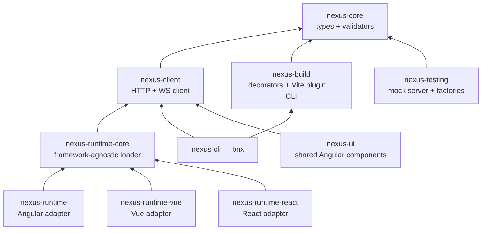

# Packages overview

Nexus ships ten npm packages under the `@bimo-dk/nexus-*` namespace. They live in the `nexus-packages` monorepo and are published to [npmjs.com](https://www.npmjs.com/org/bimo-dk).

## The dependency graph



`core` has no runtime dependencies. Everything else builds on top of it. Each framework adapter wraps `runtime-core` with framework-idiomatic ergonomics; they all use the same underlying federation primitives.

## What you install

| If you're building | You need |
|---|---|
| An Angular remote | `@bimo-dk/nexus-runtime` and `@bimo-dk/nexus-build` |
| A Vue remote | `@bimo-dk/nexus-runtime-vue` and `@bimo-dk/nexus-build` (for `nexusVite`) |
| A React remote | `@bimo-dk/nexus-runtime-react` and `@bimo-dk/nexus-build` (for `nexusVite`) |
| An Angular host | `@bimo-dk/nexus-runtime` and `@bimo-dk/nexus-client` |
| A Vue host | `@bimo-dk/nexus-runtime-vue` and `@bimo-dk/nexus-client` |
| A React host | `@bimo-dk/nexus-runtime-react` and `@bimo-dk/nexus-client` |
| A Node script that touches the registry | `@bimo-dk/nexus-client` |
| Tests | `@bimo-dk/nexus-testing` (devDependency only) |

`core` is a transitive dependency of every adapter; you don't install it directly.

## Packages

| Package | What it is |
|---|---|
| [`@bimo-dk/nexus-core`](nexus-core.md) | Types, constants, validators. Zero runtime dependencies. |
| [`@bimo-dk/nexus-client`](nexus-client.md) | HTTP + WebSocket client for the registry. Works in Node and the browser. |
| [`@bimo-dk/nexus-runtime-core`](nexus-runtime-core.md) | Framework-agnostic loader, self-registration, fallback chain, reconnect. |
| [`@bimo-dk/nexus-runtime`](nexus-runtime.md) | Angular adapter — `provideNexusHost`, `provideNexusRemote`, `nexusRoute`, `<nexus-component>`. |
| [`@bimo-dk/nexus-runtime-vue`](nexus-runtime-vue.md) | Vue 3 adapter — `createNexusPlugin`, `useNexusRemote`, `<NexusComponent>`, `nexusRoute`. |
| [`@bimo-dk/nexus-runtime-react`](nexus-runtime-react.md) | React 18 adapter — `NexusProvider`, `useNexusComponent`, `<NexusComponent>`, `createNexusRoute`. |
| [`@bimo-dk/nexus-build`](nexus-build.md) | `@NexusRemote` + `@NexusComponent` decorators (Angular), `nexusVite` plugin (Vue/React), `nexus-build` CLI. |
| [`@bimo-dk/nexus-cli`](nexus-cli.md) | `bnx` — generate, publish, status, health, dev, hosts, gates. |
| [`@bimo-dk/nexus-testing`](nexus-testing.md) | Mock factories, `MockRegistryServer`, `createMockRegistryClient`. |
| [`@bimo-dk/nexus-ui`](nexus-ui.md) | Shared Angular component library used by the portal and host templates. |

## Versioning

All packages follow semver. The repo uses [Changesets](https://github.com/changesets/changesets) to coordinate releases. Major-version bumps are coordinated across packages (e.g., upgrading Angular forces a major bump of `nexus-runtime` and `nexus-ui` together).

## Installing packages

The `@bimo-dk` packages are public — no token or `.npmrc` configuration required:

```bash
npm install @bimo-dk/nexus-runtime
```

## Next

- Pick the runtime that matches your framework:
  - [Angular](nexus-runtime.md)
  - [Vue](nexus-runtime-vue.md)
  - [React](nexus-runtime-react.md)
- [CLI: bnx](nexus-cli.md)
