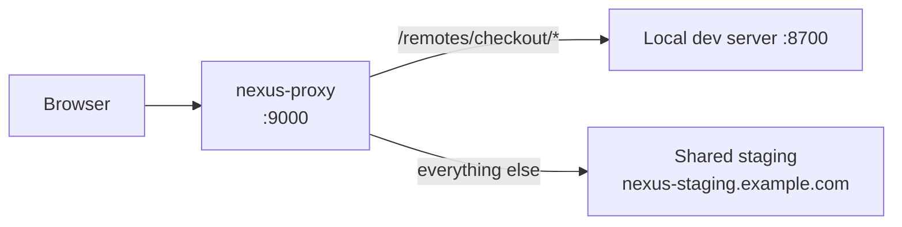

# nexus-proxy

The `nexus-proxy` repository ships the hot-reload dev proxy used by `bnx dev`. It transparently routes most traffic to your shared staging environment while pulling specific remotes from your local dev server.

## What it does



You open `http://localhost:9000`, see the whole staging application, but the routes for the remotes you're working on come from your local dev server with HMR. Nothing you do affects the shared environment.

## Repository layout

```
nexus-proxy/
├── src/
│   ├── proxy.ts             # core proxy
│   ├── routing.ts           # rules
│   ├── config.ts            # nexus.config.json loader
│   └── index.ts
├── package.json
└── tsconfig.json
```

The package is also distributed as part of `@bimo-dk/nexus-cli` so you can use it via `bnx dev` without installing it standalone.

## Usage (via `bnx dev`)

```bash
cd my-host
bnx dev
```

Reads `nexus.config.json` from the current directory and starts the proxy on the configured port (default 9000). Autostarts any local remotes with `autostart: true` and binds them in the route table.

See [packages: nexus-cli](../packages/nexus-cli.md) for the full `nexus.config.json` schema.

## Usage (standalone)

```bash
npx @bimo-dk/nexus-proxy --config ./nexus.config.json --port 9000
```

## Configuration

```jsonc
{
  "environments": {
    "staging": {
      "publicUrl": "https://nexus-staging.example.com",
      "tokenEnv": "NEXUS_STAGING_TOKEN"
    }
  },
  "dev": {
    "baseEnv": "staging",
    "proxyPort": 9000,
    "remotes": {
      "checkout": { "port": 4201, "path": "./packages/checkout", "autostart": true },
      "orders":   { "port": 4202, "path": "./packages/orders",   "autostart": false }
    },
    "logRouting": true
  }
}
```

When the proxy starts:

1. Reads `nexus.config.json`.
2. Confirms each remote is reachable on its local port.
3. Optionally autostarts any with `autostart: true`.
4. Binds the proxy:
   - `/remotes/<name>/*` → `http://localhost:<port>/<rest>` for every locally-running remote.
   - Everything else → `baseEnv.publicUrl/<rest>`.
5. Opens your browser.

Ctrl+C stops the proxy and any autostarted dev servers.

## Why a separate proxy

The alternative is editing the registry to point at your local dev server. That works once but breaks for everyone else — you'd be mutating shared state. The dev proxy lets you "override" remote selection per-developer without touching the registry.

## Next

- [Packages: nexus-cli](../packages/nexus-cli.md) — the bnx dev wrapper.
- [Workflows: dev-mode](../workflows/dev-mode.md) — operator's recipe.
