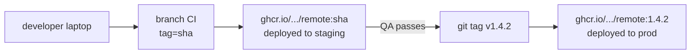

# Deployment

This page is the operator's recipe for shipping a Nexus service from a developer's laptop or CI to staging and production. For zero-downtime guarantees, pair it with [zero-downtime](zero-downtime.md).

## Build

```bash
docker build \
  --secret id=npmrc,src=$HOME/.npmrc \
  -t ghcr.io/yourorg/remote-checkout:$(git rev-parse --short HEAD) \
  -t ghcr.io/yourorg/remote-checkout:1.4.2 \
  -t ghcr.io/yourorg/remote-checkout:latest \
  .
```

The BuildKit secret mounts your `.npmrc` (with the GitHub Packages PAT) into the build container at `/root/.npmrc`. The token never lands in image-layer metadata. See [reference: security](../reference/security.md) for why this matters.

## Push

```bash
echo $GITHUB_PAT | docker login ghcr.io -u <username> --password-stdin
docker push ghcr.io/yourorg/remote-checkout:1.4.2
docker push ghcr.io/yourorg/remote-checkout:latest
```

In CI:

```yaml
# GitHub Actions
- uses: docker/login-action@v3
  with:
    registry: ghcr.io
    username: ${{ github.actor }}
    password: ${{ secrets.GITHUB_TOKEN }}

- uses: docker/build-push-action@v6
  with:
    context: .
    push: true
    tags: |
      ghcr.io/${{ github.repository }}/remote-checkout:${{ github.sha }}
      ghcr.io/${{ github.repository }}/remote-checkout:latest
    secrets: |
      "npmrc=${{ secrets.NPMRC_CONTENTS }}"
```

## Deploy via compose

```yaml
remote-checkout:
  image: ghcr.io/yourorg/remote-checkout:1.4.2
  environment:
    REGISTRY_INTERNAL_URL: http://registry:8670
    NEXUS_TOKEN: ${NEXUS_TOKEN}
    PUBLIC_URL: /remotes/checkout/remoteEntry.json
    UPSTREAM_URL: http://remote-checkout:80
  depends_on:
    - registry
  restart: unless-stopped
  healthcheck:
    test: ["CMD", "wget", "-qO-", "http://localhost/"]
    interval: 10s
```

Update without dropping traffic:

```bash
docker compose pull remote-checkout
docker compose up -d --no-deps remote-checkout
```

## Deploy via Kubernetes

A Helm chart is on the roadmap. For now, treat each Nexus service as a stateless deployment (except the registry, which needs a persistent volume for its SQLite file or a PostgreSQL connection — see [infra-high-availability](../infrastructure/infra-high-availability.md)).

Recommended:

- `Deployment` for each service.
- `Service` of type `ClusterIP` for internal traffic.
- `Ingress` only for the gateway and the portal.
- `Secret` for `NEXUS_TOKEN` and `NODE_AUTH_TOKEN`.

## Environment promotion

A typical promotion path:



- Branch builds get a SHA-prefixed tag and ship to staging automatically.
- A git tag triggers a prod build with the version number.
- Use `:latest` for staging, never for production.

## Rollback

The fastest path:

```bash
# Look up the previous tag
docker images ghcr.io/yourorg/remote-checkout

# Roll back
docker compose down remote-checkout
docker compose up -d remote-checkout --no-deps \
  --pull never \
  -e IMAGE_TAG=1.4.1
```

If your compose file pins the image tag, edit it and re-run `docker compose up -d --no-deps remote-checkout`.

For multi-instance gateways, roll back one instance at a time and confirm traffic before the next.

## Health gates

Always include a `healthcheck` in compose / a `livenessProbe` in k8s. The gateway uses `/health`. Each remote should respond `200` from `/` (nginx serves `index.html`). Failing health means the orchestrator pulls the container out of rotation.

## Database backups

The registry's SQLite file is the source of truth. Daily snapshots of the registry volume are the minimum. Test restores at least quarterly.

For PostgreSQL deployments (when shipped), use standard `pg_basebackup` + WAL archiving.

## Next

- [Workflows: zero-downtime](zero-downtime.md) — what these deploys preserve.
- [Reference: security](../reference/security.md) — token handling end to end.
- [Infra: high-availability](../infrastructure/infra-high-availability.md)
