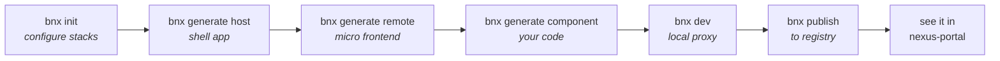
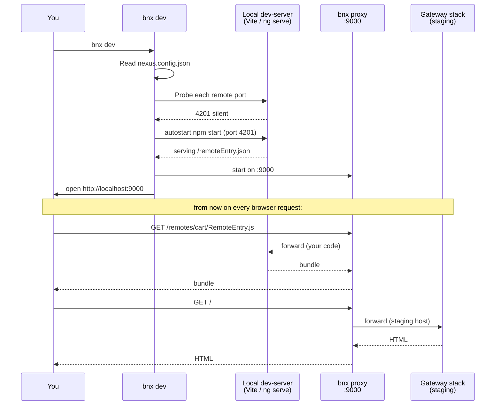
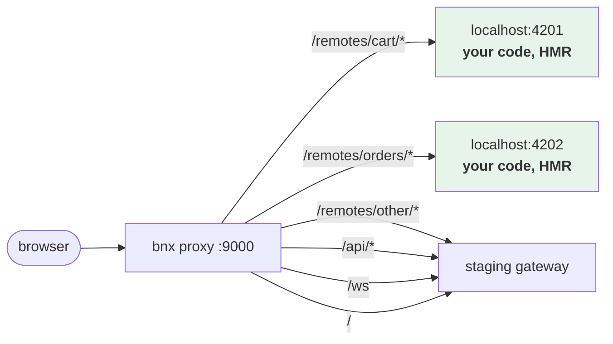
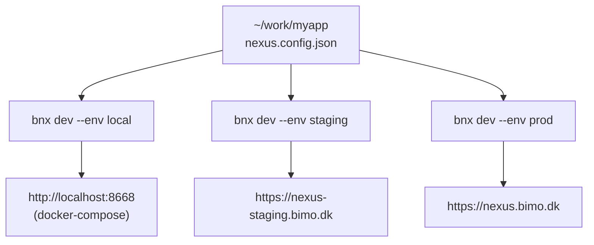

# Local dev mode — step by step

You are a developer joining a Nexus stack. The platform team already runs a gateway, registry, and portal. You want to work on **one new remote** on your machine while the rest of the application — the host shell, the other remotes, the registry, the gateway — keeps coming from the shared environment.

That is what `bnx dev` does. It runs a local HTTP proxy that splits traffic: anything you are working on goes to your machine; everything else goes to the chosen gateway stack.

This page walks the full flow, end to end, from an empty directory to a published remote visible in the portal.

## The flow at a glance



`bnx init` and `bnx generate host` are one-time per workspace. `bnx generate component` and `bnx dev` happen on every change.

## Prerequisites

- Node.js 22+
- Git (for `bnx generate host` / `generate remote` which clone the templates)
- A reachable Nexus stack — local docker-compose, staging, or prod. You will configure all three.
- `@bimo-dk/nexus-cli` installed globally:

  ```bash
  npm install -g @bimo-dk/nexus-cli
  ```

## Step 1 — `bnx init`: bootstrap the workspace

In an empty directory:

```bash
bnx init
```

The CLI asks four things in order:

1. **Which gateway stacks** you will work against (multi-select). Defaults: `local` (docker-compose at `http://localhost:8668`), `staging`, `prod`. Pick as many as your company has.
2. **The public URL** of each stack you picked.
3. **The env-var name** that holds the token for each stack. The CLI never asks for the token itself — it only records *where it will read it from*. The token lives in your shell or `.env`, not in the workspace.
4. **Default stack for `bnx dev`** (which one is implicit when you don't pass `--env`).
5. **Optionally scaffold a host now** (yes by default — see Step 2).

When it returns, the workspace contains:

```
.
├── nexus.config.json         # all stacks + dev settings
├── .env.example              # one line per token env-var, to copy to .env
└── <host-name>/              # only if you said yes in step 5
```

### Result: `nexus.config.json`

```jsonc
{
  "environments": {
    "local":   { "publicUrl": "http://localhost:8668",          "tokenEnv": "NEXUS_TOKEN_LOCAL"   },
    "staging": { "publicUrl": "https://nexus-staging.bimo.dk",  "tokenEnv": "NEXUS_TOKEN_STAGING" },
    "prod":    { "publicUrl": "https://nexus.bimo.dk",          "tokenEnv": "NEXUS_TOKEN_PROD"    }
  },
  "dev": {
    "baseEnv": "staging",
    "proxyPort": 9000,
    "host": { "mode": "proxy" },
    "remotes": {},
    "logRouting": true
  }
}
```

This single file is the source of truth for which stacks the workspace can target.

## Step 2 — `bnx generate host`: scaffold the shell

If you said no in Step 1 (or want a second host later):

```bash
bnx generate host
```

Pick a framework (Angular, Vue, or React) and a name. The CLI clones the matching `nexus-host-template-*` repo, removes its `.git`, and substitutes `__HOST_NAME__` placeholders. You end up with a host project that already imports `@bimo-dk/nexus-runtime` and is wired to load remotes from whichever registry the dev proxy points it at.

You don't need to do anything else to the host — it does not list remotes statically. It asks the registry at runtime.

## Step 3 — `bnx generate remote`: scaffold a remote

```bash
bnx generate remote
```

Interactive: pick a name (camelCase), a route (kebab-case), a framework, and visibility (global, or scoped to a specific host).

The CLI clones the matching `nexus-remote-templat-*` repo. Same substitution pattern as the host. The remote ships pre-wired with `@bimo-dk/nexus-build`, which means **`vite.config.ts` is two lines and never has to change again** — see step 4.

## Step 4 — `bnx generate component`: add your code

This is the only step you repeat per feature.

```bash
cd <remote>
bnx generate component Cart \
  --category commerce \
  --description "Sticky cart with item count" \
  --tags "vue,cart,sticky"
```

The framework is autodetected from the remote's `package.json`. The CLI writes one file:

- Vue → `src/Cart.vue` (SFC with a `defineNexusComponent(...)` script tag)
- React → `src/Cart.tsx` (function component wrapped in `defineNexusComponent(...)`)
- Angular → `src/cart.component.ts` (standalone class with `@NexusRemote()` + `@NexusComponent()`)

The next time you run `npm run build`, the build's auto-scanner picks up the new file, adds it to the federation `exposes`, and writes a new entry to `dist/catalog.json`. **You never edit `vite.config.ts`.** Adding a fifth component is the same as adding the first.

## Step 5 — `bnx dev`: run the local proxy

```bash
bnx dev
```

What happens, in order:



The output looks like this:

```
Bimo-Nexus dev
  config:     /work/myapp/nexus.config.json
  baseEnv:    staging (https://nexus-staging.bimo.dk)
  proxyPort:  9000

  + cart            listening on :4201 (verified federation entry)
  + orders          listening on :4202 (verified federation entry)

  Open this:  http://localhost:9000
  Shared env: https://nexus-staging.bimo.dk
  Local remotes:
    /remotes/cart   -> http://localhost:4201
    /remotes/orders -> http://localhost:4202
```

### How traffic is split



Anything under `/remotes/<name>/*` for a remote in `dev.remotes` goes local. **Everything else** — the host shell at `/`, the registry at `/api/*`, the registry WebSocket at `/ws`, and any remote you haven't listed in `dev.remotes` — goes to the gateway stack.

Result: you see the entire application live, but the parts you are working on are served from your machine with HMR. Nothing you do affects the shared environment.

## Step 6 — switching gateway stacks

A workspace can target several stacks. Use `--env` per `bnx dev` run:

```bash
bnx dev                 # uses dev.baseEnv from nexus.config.json
bnx dev --env local     # work against http://localhost:8668 (docker-compose)
bnx dev --env staging   # work against staging
bnx dev --env prod      # read-only smoke test against prod
```



Each stack reads its own token env-var (`NEXUS_TOKEN_LOCAL`, `NEXUS_TOKEN_STAGING`, `NEXUS_TOKEN_PROD`) so you cannot accidentally point a local proxy at prod with a staging token.

## Step 7 — `bnx publish`: register with the stack

When you are happy with your remote and ready to share it:

```bash
npm run build
bnx publish
```

Publish reads `federation.config.json` and `dist/catalog.json`, then calls the registry. Output:

```
> Publishing "cart" to https://nexus-staging.bimo.dk/api/remotes
  url=/remotes/cart/remoteEntry.json route=cart exposedModule=./RemoteEntry
+ Registered "cart"
  catalog: 4 components in dist/catalog.json
    - ./RemoteEntry         Cart entry
    - ./CartBadge           Sticky cart badge
    - ./CartDrawer          Slide-in cart drawer
    - ./CheckoutButton      Checkout CTA button
```

The gateway adds the route within milliseconds — no restart, no deploy step.

## Step 8 — see it in the portal

Open `https://nexus-staging.bimo.dk/portal` (or whichever portal corresponds to the stack you published to). Log in.

### Catalog page

The portal aggregates `catalog.json` from every registered remote. Your new remote and its components show up here within a second of `bnx publish` returning:


Click a row to see how to use the component in each host framework, plus a live preview:


### Remotes page

Lists every remote registered with the registry. The new one is at the top:


### Hosts page

Lists the registered shells. A host is what the gateway serves at `/` — every remote you publish gets loaded by whichever host is gating the domain.


### Gates page

Gates map domains to hosts. The same remote can appear in a Vue shop, a React shop, and an Angular admin without rebuilding the remote — that is what makes the Catalog cross-framework.


## Flags reference

| Flag | Default | Purpose |
|---|---|---|
| `-c, --config <file>` | search cwd | path to `nexus.config.json` |
| `-p, --port <port>` | from config (9000) | override proxy port |
| `-e, --env <name>` | `dev.baseEnv` | override which gateway stack to target |
| `--gate <name>` | unset | set `NEXUS_GATE_NAME` for the proxy so a multi-gate stack hits the right gate |
| `--no-open` | open=true | don't open the browser |
| `--no-autostart` | autostart=true | don't autostart configured remotes |

## Status

```bash
bnx dev status
```

Probes each configured remote port and reports which are listening with a valid `remoteEntry.json`. Quick sanity check before opening the browser.

## Multi-developer story

Every developer has their own `nexus.config.json` and runs their own `bnx dev`. Nothing they do affects the shared environment. The dev proxy intercepts only their local browser traffic. When you push to your branch and CI publishes the remote, the next developer that hits staging sees your change — no restart, no portal action.

## Next

- [Packages: nexus-cli](../packages/nexus-cli.md) — full CLI reference.
- [Workflows: deployment](deployment.md) — how publish flows into CI.
- [Workflows: component catalog](component-catalog.md) — the portal page tour.
- [Infrastructure: portal](../infrastructure/infra-portal.md) — page-by-page portal reference.
