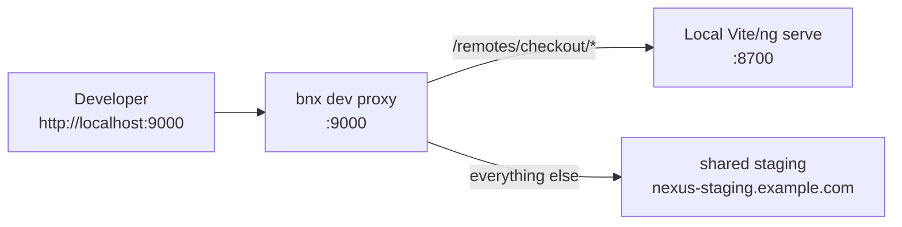

# Local dev mode

`bnx dev` runs a proxy that routes most traffic to your shared staging environment, while pulling specific remotes from your local dev server with HMR. You work on your own remote without touching anyone else's environment.

## The flow



## Configure

Create `nexus.config.json` at the root of your workspace:

```jsonc
{
  "environments": {
    "staging": {
      "publicUrl": "https://nexus-staging.example.com",
      "tokenEnv": "NEXUS_STAGING_TOKEN"
    },
    "prod": {
      "publicUrl": "https://nexus.example.com",
      "tokenEnv": "NEXUS_PROD_TOKEN"
    }
  },
  "dev": {
    "baseEnv": "staging",
    "proxyPort": 9000,
    "remotes": {
      "checkout": { "port": 4201, "path": "./packages/checkout", "autostart": true },
      "orders":   { "port": 4202, "path": "./packages/orders",   "autostart": false }
    },
    "logRouting": true
  }
}
```

Export the staging token in your shell:

```bash
export NEXUS_STAGING_TOKEN=...
```

## Run

```bash
bnx dev
```

Output:

```
Nexus dev
  config:     /work/myapp/nexus.config.json
  baseEnv:    staging (https://nexus-staging.example.com)
  proxyPort:  9000

  ✓ checkout         listening on :4201 (verified federation entry)
  ↑ orders           autostart npm start in ./packages/orders (port 4202)
  ✓ orders           listening on :4202 (verified federation entry)

  Open:  http://localhost:9000
  Shared env: https://nexus-staging.example.com
  Local remotes:
    /remotes/checkout         -> http://localhost:4201
    /remotes/orders           -> http://localhost:4202

Press Ctrl+C to stop everything.
```

Open `http://localhost:9000` — you see the entire staging app, but with your local changes for the listed remotes.

## Options

| Flag | Default | Purpose |
|---|---|---|
| `-c, --config` | search cwd | path to `nexus.config.json` |
| `-p, --port` | from config | override proxy port |
| `--gate <name>` | unset | act as a specific gate (sets `NEXUS_GATE_NAME` for the proxy) |
| `--no-open` | open=true | don't open the browser |
| `--no-autostart` | autostart=true | don't autostart configured remotes |

## Status

```bash
bnx dev status
# Nexus dev — status
#   config:  /work/myapp/nexus.config.json
#   baseEnv: staging -> https://nexus-staging.example.com
#
#   Shared env: reachable
#
#   Local remotes:
#     checkout            :4201   serving remoteEntry.json
#     orders              :4202   not running
```

## Multi-developer story

Each developer has their own `nexus.config.json` and runs their own `bnx dev`. Nothing they do affects the shared staging environment. The dev proxy intercepts only their local browser traffic.

When you push to your branch, your remote's CI deploys to staging — the next developer that hits staging sees your change.

## Tip — gate impersonation

If your stack has multiple gates and a remote behaves differently per gate, pass `--gate <name>` so the proxy sends the right `Host` header to staging.

## Next

- [Packages: nexus-cli](../packages/nexus-cli.md)
- [Services: proxy](../services/proxy.md) — under the hood.
- [Workflows: deployment](deployment.md)
