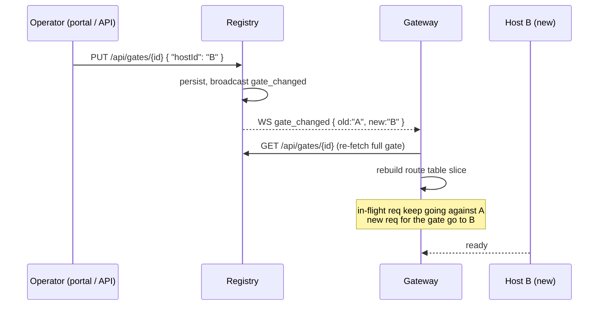

# Swap the host on a gate

A gate is a public domain. A host is the shell application a gate is bound to. Repointing the gate from host A to host B is the operational move you reach for when you want to:

- Test a rewritten shell against existing remotes and traffic.
- Gradually cut over from a legacy host to a new one.
- Run an A/B between two layouts on the same audience.
- Recover quickly when a fresh host deploy is misbehaving — point the gate back at the previous host.

The cutover is one PUT against the registry. Everything else is automatic.

## How it works

1. You PUT a new `hostId` on the gate.
2. The registry persists the change and broadcasts `gate_changed` with `old_host_id` and `new_host_id`.
3. Every gateway instance subscribed to the registry receives the broadcast, re-fetches the full gate, and rebuilds the affected slice of its route table — atomically.
4. In-flight requests against the old host continue to completion. New requests for the gate's domain land on the new host.
5. The browser tab that is mid-render keeps running its current bundle until the user navigates; on next navigation, the host's bootstrap reads the new shell. No reload needed.



## Doing the swap

### From the portal

1. Hosts page — confirm host B exists, is enabled, and has the right `remoteEntry` / `exposedModule` set.
2. Gates page — open the gate, edit `hostId` to host B, save.
3. The status line shows `host_reassigned` immediately. Open the gate's domain in a browser to verify.

### From the API

```bash
# Find the gate id (use the gate name or the domain).
curl -H "X-Nexus-Token: $NEXUS_TOKEN" \
  "$REGISTRY_URL/api/gates/by-domain/shop.example.com"

# Swap. The body is partial — only the field you change is required.
curl -X PUT \
  -H "X-Nexus-Token: $NEXUS_TOKEN" \
  -H "Content-Type: application/json" \
  -d '{ "hostId": "<host-b-id>" }' \
  "$REGISTRY_URL/api/gates/<gate-id>"

# Verify.
curl -H "X-Nexus-Token: $NEXUS_TOKEN" \
  "$REGISTRY_URL/api/gates/<gate-id>"
```

## Common patterns

### Gradual rollout via two gates

You can stand a new gate `shop-beta.example.com` pointing at host B alongside the existing `shop.example.com` pointing at host A. Traffic on the beta domain is your canary; flip the production gate when you're satisfied.

```
shop.example.com         → host A (production shell)
shop-beta.example.com    → host B (new shell, same remotes)
```

When ready:

```bash
curl -X PUT ... -d '{ "hostId": "<host-b-id>" }' \
  "$REGISTRY_URL/api/gates/<production-gate-id>"
```

### Instant rollback

If the new host misbehaves, swap back. The registry keeps no audit lock — the same PUT with the original `hostId` reverts the gate.

For a versioned audit trail of every gate / remote change (and a one-call revert), see [rollback](rollback.md).

### Per-gate branding without swapping hosts

If the only difference between the two domains is a brand header — same host, same remotes, different chrome — use the gate's `customHeaders` and shared remotes instead of two host applications. See [multi-domain setup](multi-domain-setup.md).

## What you do not need to do

- **You do not redeploy the gateway.** The route table swap is hot.
- **You do not restart the registry.** It is the source of truth and serves the swap atomically.
- **You do not change DNS.** The domain stays the same; only what serves it changes.
- **You do not coordinate with remote teams.** Their remotes are independent of which host renders them — the host imports them via the registry's catalog.

## What can go wrong

| Symptom | Likely cause | Check |
|---|---|---|
| Gate swap returns 409 | The new host is disabled or doesn't exist | `GET /api/hosts/{id}` — confirm enabled + correct framework |
| Browser still sees the old shell | The user has the old bundle cached; will see the new one on next navigation | Force navigate or hard reload |
| New host renders but remotes don't | The new host's `framework` doesn't match the remotes' federation manifests | Check `framework` on the host record |
| Other gates flip too | You edited the host record, not the gate. Host edits affect every gate using that host | PUT against `/api/gates/<id>`, not `/api/hosts/<id>` |

## Next

- [Rollback](rollback.md) — versioned undo across remote + host + gate changes.
- [Multi-domain setup](multi-domain-setup.md) — adding new gates and the per-gate headers pattern.
- [Hosts and gates setup](hosts-and-gates-setup.md) — the underlying model.
- [Zero-downtime deployment](zero-downtime.md) — the cache rules that make the swap user-invisible.
