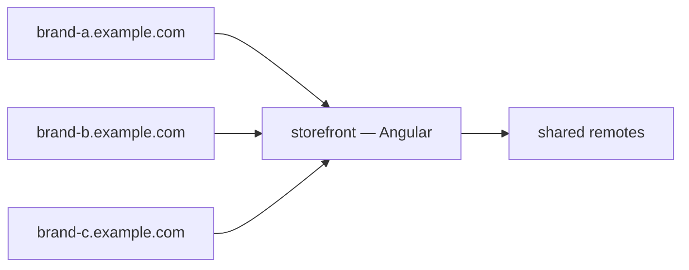

# Multi-domain setup

Use gates to point many public domains at a single host application. Useful for white-label, multi-brand, regional storefronts, and per-domain header overrides.

## The model



Each gate has its own `name`, `domain`, and (optionally) a different `customHeaders` set or framework override. The host application reads the `Host` header at render time and adjusts theming or content as needed.

## Steps

### 1. Create the host (once)

```bash
bnx hosts create
? Host name: storefront
? URL: http://host-angular:80
? Framework: angular
? Remote entry: /remoteEntry.json
? Exposed module: ./AppShell
```

Or POST manually:

```bash
curl -X POST http://localhost:8668/api/hosts \
  -H "X-Nexus-Token: $NEXUS_TOKEN" \
  -H "Content-Type: application/json" \
  -d '{
    "name": "storefront",
    "url": "http://host-angular:80",
    "framework": "angular",
    "remoteEntry": "/remoteEntry.json",
    "exposedModule": "./AppShell"
  }'
```

### 2. Create one gate per domain

```bash
bnx gates create
? Gate name: brand-a-prod
? Domain: brand-a.example.com
? Host: storefront

bnx gates create
? Gate name: brand-b-prod
? Domain: brand-b.example.com
? Host: storefront
```

The gateway's route table updates within milliseconds — no restart.

### 3. DNS

Point each domain at the gateway's load balancer.

### 4. TLS

Use the gateway's CDN/LB layer for TLS termination. The gateway itself runs HTTP internally; TLS is upstream.

### 5. Per-gate custom headers

Override response headers per gate via the portal (Gates → edit → Custom headers) or PUT to `/api/gates/{id}`:

```bash
curl -X PUT http://localhost:8668/api/gates/$GATE_ID \
  -H "X-Nexus-Token: $NEXUS_TOKEN" \
  -H "Content-Type: application/json" \
  -d '{
    "customHeaders": [
      { "name": "X-Brand", "value": "brand-a" },
      { "name": "Content-Security-Policy", "value": "default-src https://brand-a.example.com" }
    ]
  }'
```

Useful for:

- Per-brand CSP.
- Per-domain Open Graph / Twitter cards (set `og:url` to the requested domain).
- Per-domain feature flags via response headers.

### 6. Branding at render time

The host reads `window.location.hostname` (or a server-injected variable) and selects:

- The theme palette.
- The logo and favicon.
- The default locale.
- Which remotes show up in nav (if you also use host-specific visibility).

The pattern is the same regardless of framework — branding decisions happen at render time, not deploy time.

## Switching a gate to a different host

Move a gate from `storefront-v1` to `storefront-v2`:

```bash
curl -X PUT http://localhost:8668/api/gates/$GATE_ID \
  -H "X-Nexus-Token: $NEXUS_TOKEN" \
  -H "Content-Type: application/json" \
  -d '{ "hostId": "<v2-host-id>" }'
```

The registry broadcasts `gate_changed` with `trigger: "host_reassigned"`. The gateway swaps the host upstream in its table. The change is instant; open tabs continue serving the old host until they reload.

This is the safe way to roll out a major host rewrite or a framework migration.

## Mixed-framework white-label

Different gates can resolve to *different* hosts — including hosts in different frameworks:

```
brand-a.example.com   -> storefront (Angular)
brand-b.example.com   -> storefront (Angular)
admin.brand-a.example.com -> admin (Vue)
```

Make sure each host's remote visibility covers the right scope. Use `host:<id>` visibility for admin-only or brand-only remotes.

## Next

- [Workflows: hosts-and-gates-setup](hosts-and-gates-setup.md) — the basic three-entity setup.
- [Infra: hosts-and-gates](../infrastructure/infra-hosts-and-gates.md) — mental model.
- [Reference: api-reference](../reference/api-reference.md) — endpoints used here.
