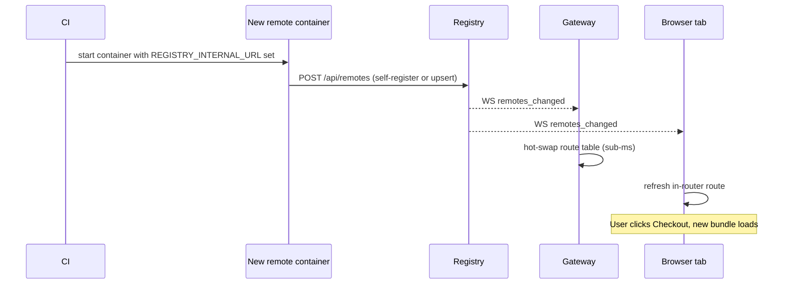

# Zero-downtime deploys

A new build of any single Nexus piece — a remote, the host, the registry, the gateway — should be invisible to users in flight. This page explains why and how, then gives the deploy recipe.

## Why a remote deploy doesn't break the user

Three things have to be true:

1. **The browser must not cache `remoteEntry.json`.** The gateway sets `Cache-Control: no-store` on `*remoteEntry.{js,json}` and `*chunk-*.js`. When the new container is live, the next request loads new chunks.
2. **The router must learn about the change.** The new remote container self-registers; the registry broadcasts `remotes_changed`; the host updates its route in milliseconds.
3. **The gateway proxy must learn about the change.** The gateway listens to the same broadcast and hot-swaps its routing table — no nginx reload, no dropped connection.



## The cache rules

The gateway enforces:

| Path pattern | `Cache-Control` |
|---|---|
| `*remoteEntry.{js,json}` | `no-store` |
| `*chunk-*.js` | `no-store` |
| Other content-hashed JS/CSS | `immutable, max-age=31536000` |

The remote's nginx config may override these — but you typically shouldn't. The defaults are what make zero-downtime work.

## Deploy a remote

```bash
# Build a new image
docker build -t ghcr.io/yourorg/remote-checkout:1.4.2 .

# Push
docker push ghcr.io/yourorg/remote-checkout:1.4.2

# Replace the container (rolling)
docker compose pull remote-checkout
docker compose up -d --no-deps remote-checkout
```

What happens:

1. The old container is stopped after a 10-second drain.
2. The new container starts. Its bootstrap calls `POST /api/remotes` to update the registration (the entry already exists, so it's an upsert via the `PUT /api/remotes/{name}` path that the adapter uses for re-registration).
3. The registry broadcasts `remotes_changed`.
4. Every open browser tab and the gateway pick up the change.
5. Next navigation to the route serves new bundles.

## Deploy the host

A host deploy is a regular container replacement. Browser tabs that loaded the *old* host keep the *old* host in memory until they reload — that's standard SPA behavior. New tabs get the new host immediately.

To force every tab to refresh, broadcast a `config_changed` signal from the registry (or a custom event) and have the host runtime react.

## Deploy the registry

A registry restart is a few seconds of read-only fallback for new browser tabs (open tabs are unaffected — they have cached remotes). The gateway reconnects with exponential backoff and resyncs.

For zero-downtime registry deploys, run the multi-instance setup described in [infra-high-availability](../infrastructure/infra-high-availability.md).

## Deploy the gateway

A single-gateway deploy is a brief outage for that gateway. Run two or more behind a load balancer for true zero-downtime gateway deploys.

## What can still go wrong

| Failure | Why | Fix |
|---|---|---|
| Stale `remoteEntry.json` in CDN | Some CDNs override `Cache-Control`. | Set `no-store` at the CDN too. |
| Old bundle reused after deploy | Your nginx upstream caches. | Mirror the gateway's `no-store` rules. |
| Two versions of the same remote in one tab | Active SPA session holds the loaded chunk. | Expected — the user refresh-cycle picks up the new version. |
| `remotes_changed` not delivered | Browser tab's WebSocket is closed. | The host reconnects with backoff and re-fetches the snapshot. |

## Rolling release recipe (multi-remote)

```bash
# Deploy in this order to minimize visible impact:
docker compose up -d --no-deps remote-catalog
docker compose up -d --no-deps remote-orders
docker compose up -d --no-deps remote-checkout
docker compose up -d --no-deps host-angular
# Registry and gateway last (HA recommended)
```

Watch `bnx health` between steps. If any remote returns unhealthy, pause.

## Next

- [Workflows: deployment](deployment.md) — image build and tagging.
- [Infra: high-availability](../infrastructure/infra-high-availability.md)
- [Getting started: architecture](../getting-started/architecture.md) — request and broadcast flow.
